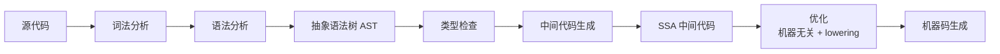

# 前言

希望有一天能够真正有机会和一群志同道合人的人为梦想努力。
哎呀我去，这玩意怎么这么难，我去了。

# 准备工作

## 1.1调试源代码

./src/make.bash脚本会编译 Go 语言的二进制、工具链以及标准库和命令并将源代码和编译好的二进制文件移动到对应的位置上.现在go语言应该是在`$GOROOT/src`下面

Go语言编译过程中需要生成中间代码，中间代码具有 SSA（静态单赋值）的特性

Go编译汇编语法：
```bash
go build -gcflags -S main.go
```
注意go编译的汇编是无法通过GCC汇编器的

Go语言获取汇编指令优化过程：
```bash
GOSSAFUNC=main go build main.go
# runtime
dumped SSA to /usr/local/Cellar/go/1.14.2_1/libexec/src/runtime/ssa.html
# command-line-arguments
dumped SSA to ./ssa.html
```

# 编译原理

## 2.1编译过程

AST（抽象语法树）：

是源代码语法的结构的一种抽象表示，这个抽象语法树会辅助编译器进行语义分析，我们可以用它来确定语法正确的程序是否存在一些类型不匹配的问题。

SSA（静态单赋值）：

静态单赋值（Static Single Assignment、SSA）是中间代码的特性，如果中间代码具有静态单赋值的特性，那么每个变量就只会被赋值一次。SSA 的主要作用是对代码进行优化，所以它是编译器后端的一部分。

指令集：

```bash
uname -m #查看当前电脑硬件信息
```

- 复杂指令集(CISC)
- 精简指令集(RISC)

编译原理：

go的编译器源码在src/cmd/compile，编译器的前端一般承担着词法分析、语法分析、类型检查和中间代码生成几部分工作，而编译器后端主要负责目标代码的生成和优化，也就是将中间代码翻译成目标机器能够运行的二进制机器码。



各阶段对应的包：

| 阶段 | 包 / 关键类型 | 产物 |
| --- | --- | --- |
| 词法分析 | `internal/syntax`（`scanner`） | `token` 流 |
| 语法分析 | `internal/syntax`（`parser`） | `syntax.Node`（语法树） |
| 类型检查 | `internal/types2`（旧版为 `gc`） | 带类型信息的节点 |
| 中间代码生成 | `internal/walk` + `internal/ssa` | `ir.Node` → SSA 值 |
| 后端优化 | `internal/ssa` 的多轮 pass | 机器相关的 SSA |
| 机器码生成 | `internal/ssa` + `internal/objw` | 汇编码 → 目标文件 |

> ⚠️ AST 是**语法分析**的产物，不是类型检查的产物。类型检查是拿 AST 当输入，在它上面做类型推断和函数内联，输出的是带类型信息的节点。把 AST 画在类型检查之后是错的。

> ⚠️ 这本书成书于 Go 1.14 前后。从 Go 1.18（泛型落地）起，前端流程被 `noder` 包重构：类型检查与 IR 生成都收拢在 `noder` 里，由 `types2` 完成类型检查后直接转换成 `ir.Node`，早期那个独立的 `gc` 类型检查阶段已经不存在了。

词法分析会返回一个不包含空格、换行等字符的 Token 序列，例如：package, json, import, (, io, ), …，而语法分析会把 Token 序列转换成有意义的结构体，即语法树

每一个 AST 都对应着一个单独的 Go 语言文件，这个抽象语法树中包括当前文件属于的包名、定义的常量、结构体和函数等。

类型检查阶段不止会对节点的类型进行验证，还会展开和改写一些内建的函数，例如 make 关键字在这个阶段会根据子树的结构被替换成 runtime.makeslice 或者 runtime.makechan 等函数。

在类型检查之后，编译器会通过 cmd/compile/internal/gc.compileFunctions 编译整个 Go 语言项目中的全部函数，这些函数会在一个编译队列中等待几个 Goroutine 的消费，并发执行的 Goroutine 会将所有函数对应的抽象语法树转换成中间代码。

## 2.2 词法与语法分析

词法分析：

将源代码拆分为Token序列的过程

lex：用于生成词法分析器的工具，lex 生成的代码能够将一个文件中的字符分解成 Token 序列，lex 作为一个代码生成器，使用了类似 C 语言的语法，我们将 lex 理解为正则匹配的生成器，它会使用正则匹配扫描输入的字符流。但是Go有自己的“lex”，而lex自己的办法是.l文件通过lex生成C语言代码，将 C 语言代码通过 gcc 编译成二进制代码之后，就可以使用管道将上面提到的 Go 语言代码作为输入传递到生成的词法分析器中。

Go 语言的词法解析是通过 src/cmd/compile/internal/syntax/scanner.go6 文件中的 cmd/compile/internal/syntax.scanner 结构体实现的，这个结构体会持有当前扫描的数据源文件、启用的模式和当前被扫描到的 Token。

src/cmd/compile/internal/syntax/tokens.go7 文件中定义了 Go 语言中支持的全部 Token 类型。

语法分析：

通过文法确定语法结构，文法用来形式化、精确描述某种编程语言的工具，主要包含一系列用于转换字符串的生产规则（Production rule）。文法都由以下的四个部分组成：

终结符是文法中无法再被展开的符号，而非终结符与之相反，还可以通过生产规则进行展开，例如 “id”、“123” 等标识或者字面量。
- N 有限个非终结符的集合；
- Σ 有限个终结符的集合；
- P 有限个生产规则12的集合；
- S 非终结符集合中唯一的开始符号；

如何理解扇面书N，Σ等呢？很简单，可以将其判断为一个规则P，然后逐渐将其中的N替换为对应的含Σ的另一个P然后继续分，比如：

*第一步：原始C++代码（源码）*
```cpp
int main()
{
    cout << "hello world" << endl;
    return 0;
}
```
> 词法分析之后，得到**终结符Token序列**（就是$\Sigma$里面的符号，无中文）：
```
int  main  (  )  {  cout  <<  "hello world"  <<  endl  ;  return  0  ;  }
```

我们使用文法：
$$
\begin{align*}
G&=(N,\Sigma,P,S)\\
N&=\{Program,\ FuncDef,\ Type,\ Id,\ StmtList,\ Stmt,\ OutputStmt,\ ReturnStmt,\ Constant\}\\
\Sigma&=\{\texttt{int},\texttt{main},\texttt{cout},\texttt{<<},\texttt{"hello world"},\texttt{endl},\texttt{return},\texttt{0},\texttt{(},\texttt{)},\texttt{\{},\texttt{\}},\texttt{;}\}\\
P&=\begin{cases}
Program \rightarrow FuncDef \\
FuncDef \rightarrow Type\ Id\ (\ )\ \{ \ StmtList\ \} \\
Type \rightarrow int \\
Id \rightarrow main \\
StmtList \rightarrow Stmt\ StmtList \\
StmtList \rightarrow \varepsilon \\
Stmt \rightarrow OutputStmt \\
Stmt \rightarrow ReturnStmt \\
OutputStmt \rightarrow cout\ <<\ Constant\ <<\ endl\ ; \\
ReturnStmt \rightarrow return\ Constant\ ; \\
Constant \rightarrow "hello world" \\
Constant \rightarrow 0
\end{cases}\\
S&=Program
\end{align*}
$$

---

*模拟编译器：自顶向下推导（从开始符号$Program$出发，一步步替换）*
> $\Rightarrow$ 代表：使用一条产生式，替换左边非终结符为右边符号串。

1. 起始：$\boldsymbol{Program}$
$$
Program \Rightarrow FuncDef
$$
> 使用规则：$Program \rightarrow FuncDef$

2.
$$
FuncDef \Rightarrow Type\ Id\ (\ )\ \{ \ StmtList\ \}
$$
> 使用规则：$FuncDef \rightarrow Type\ Id\ (\ )\ \{ \ StmtList\ \}$

3. 替换非终结符 $Type$
$$
Type\ Id\ (\ )\ \{ \ StmtList\ \} \Rightarrow \boldsymbol{int}\ Id\ (\ )\ \{ \ StmtList\ \}
$$
> 使用规则：$Type \rightarrow int$

4. 替换非终结符 $Id$
$$
int\ Id\ (\ )\ \{ \ StmtList\ \} \Rightarrow int\ \boldsymbol{main}\ (\ )\ \{ \ StmtList\ \}
$$
> 使用规则：$Id \rightarrow main$

5. 替换非终结符 $StmtList$，选规则 $StmtList\rightarrow Stmt\ StmtList$
$$
int\ main\ (\ )\ \{ \ StmtList\ \} \Rightarrow int\ main\ (\ )\ \{ \ \boldsymbol{Stmt}\ StmtList\ \}
$$
> 使用规则：$StmtList \rightarrow Stmt\ StmtList$

6. 替换第一个 $Stmt$，选 $Stmt\rightarrow OutputStmt$
$$
int\ main\ (\ )\ \{ \ Stmt\ StmtList\ \} \Rightarrow int\ main\ (\ )\ \{ \ \boldsymbol{OutputStmt}\ StmtList\ \}
$$
> 使用规则：$Stmt \rightarrow OutputStmt$

7. 替换 $OutputStmt$
$$
OutputStmt \Rightarrow cout\ <<\ Constant\ <<\ endl\ ;
$$
$$
int\ main\ (\ )\ \{ \ OutputStmt\ StmtList\ \}
\Rightarrow int\ main\ (\ )\ \{ \ cout\ <<\ \boldsymbol{Constant}\ <<\ endl\ ;\ \ StmtList\ \}
$$
> 使用规则：$OutputStmt \rightarrow cout\ <<\ Constant\ <<\ endl\ ;$

8. 替换 $Constant$，选 $Constant\rightarrow "hello world"$
$$
int\ main\ (\ )\ \{ \ cout\ <<\ Constant\ <<\ endl\ ;\ \ StmtList\ \}
\Rightarrow int\ main\ (\ )\ \{ \ cout\ <<\ \boldsymbol{"hello world"}\ <<\ endl\ ;\ \ StmtList\ \}
$$
> 使用规则：$Constant \rightarrow "hello world"$

9. 现在处理剩下的 $StmtList$，继续展开：$StmtList\rightarrow Stmt\ StmtList$
$$
int\ main\ (\ )\ \{ \ cout\ <<\ "hello world"\ <<\ endl\ ;\ \ StmtList\ \}
\Rightarrow int\ main\ (\ )\ \{ \ cout\ <<\ "hello world"\ <<\ endl\ ;\ \ \boldsymbol{Stmt}\ StmtList\ \}
$$
> 使用规则：$StmtList \rightarrow Stmt\ StmtList$

10. 替换第二个 $Stmt$，选 $Stmt\rightarrow ReturnStmt$
$$
int\ main\ (\ )\ \{ \ cout\ <<\ "hello world"\ <<\ endl\ ;\ \ Stmt\ StmtList\ \}
\Rightarrow int\ main\ (\ )\ \{ \ cout\ <<\ "hello world"\ <<\ endl\ ;\ \ \boldsymbol{ReturnStmt}\ StmtList\ \}
$$
> 使用规则：$Stmt \rightarrow ReturnStmt$

11. 替换 $ReturnStmt$
$$
ReturnStmt \Rightarrow return\ Constant\ ;
$$
$$
int\ main\ (\ )\ \{ \ cout\ <<\ "hello world"\ <<\ endl\ ;\ \ ReturnStmt\ StmtList\ \}
\Rightarrow int\ main\ (\ )\ \{ \ cout\ <<\ "hello world"\ <<\ endl\ ;\ \ return\ \boldsymbol{Constant}\ ;\ \ StmtList\ \}
$$
> 使用规则：$ReturnStmt \rightarrow return\ Constant\ ;$

12. 替换这里的 $Constant$，选 $Constant\rightarrow 0$
$$
int\ main\ (\ )\ \{ \ cout\ <<\ "hello world"\ <<\ endl\ ;\ \ return\ Constant\ ;\ \ StmtList\ \}
\Rightarrow int\ main\ (\ )\ \{ \ cout\ <<\ "hello world"\ <<\ endl\ ;\ \ return\ \boldsymbol{0}\ ;\ \ StmtList\ \}
$$
> 使用规则：$Constant \rightarrow 0$

13. 最后剩下的 $StmtList$，使用空串规则 $StmtList\rightarrow \varepsilon$（$\varepsilon$代表删掉，什么都不写）
$$
int\ main\ (\ )\ \{ \ cout\ <<\ "hello world"\ <<\ endl\ ;\ \ return\ 0\ ;\ \ StmtList\ \}
\Rightarrow int\ main\ (\ )\ \{ \ cout\ <<\ "hello world"\ <<\ endl\ ;\ \ return\ 0\ ;\ \ \varepsilon\ \}
$$
> 使用规则：$StmtList \rightarrow \varepsilon$

---

✅ 推导完成
全部非终结符都被替换完毕，只剩下**终结符序列**：
$$
\boldsymbol{int\ main\ (\ )\ \{ \ cout\ <<\ "hello world"\ <<\ endl\ ;\ \ return\ 0\ ;\ \}}
$$
这正好就是我们写的hello world经过词法分析后的Token流。

---

关键总结：

1. 推导成功 = 语法合法；如果某一步找不到匹配的产生式，就报语法错误。

> 真实编译器是**自底向上归约**（反过来做），上面是自顶向下推导，方便理解。

在这里我们可以从 src/cmd/compile/internal/syntax/parser.go13 文件中摘抄一些 Go 语言文法的生产规则.

自顶向下是先用目标文法来判断当前是否符合，即：你手里只有「目标是 Program」，没有别的信息。于是你猜：Program 大概长成 FuncDef 吧？展开一看，跟输入对上了，继续猜 FuncDef 由 Type Id ( ) { StmtList } 组成……猜错了就退回来换一条规则重猜，这个「退回来」就是回溯。

而自底向上是输入确定，看到栈顶 int 能匹配 Type -> int，就把 int 打包成 Type；看到 return 0 ; 能匹配 ReturnStmt -> return Constant ;而归约成 Program 的那一刻，就等于宣布「语法合法」。

即通过判断Token流是否符合文法来判断是否符合Go语法😢（难难）


Lookahead（向前查看）：

在不同生产规则发生冲突时，当前解析器需要通过预读一些 Token 判断当前应该用什么生产规则对输入流进行展开或者归约。Go语言通过实现即无需额外空间：
```go
if p.tok == tok {   // 先看一眼
    p.next()        // 确认了才消费掉
    return true
  }
```

## 类型检查

强弱类型：大体就是强类型明确定义，弱类型常常隐式转换，Go算强类型语言

静态类型检查：

它能够减少程序在运行时的类型检查，也可以被看作是一种代码优化的方式。

动态类型检查：

动态类型检查是在运行时确定程序类型安全的过程，它需要编程语言在编译时为所有的对象加入类型标签等信息，运行时可以使用这些存储的类型信息来实现动态派发、向下转型、反射以及其他特性6。

执行过程：

Go 语言的编译器不仅使用静态类型检查来保证程序运行的类型安全，还会在编程期间引入类型信息，让工程师能够使用反射来判断参数和变量的类型。


