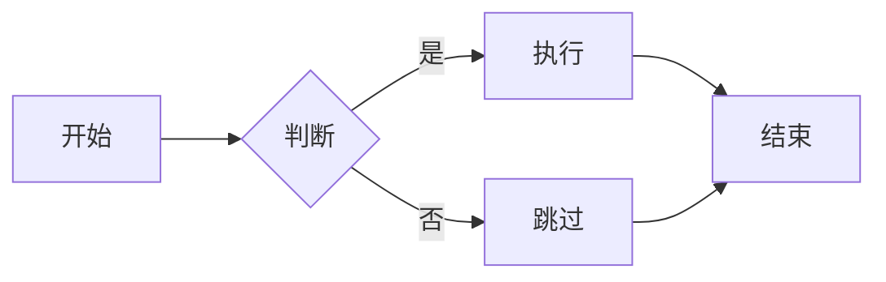

## 前言

虽然喜欢用ai帮我写文章，不过还是想详细学习下

```markdown
# 我是标题
**我是加粗**
```

上面这一小段文字，渲染之后就变成了：

> **（请脑补一个大号加粗标题和一段加粗文字）**

Markdown 由 [John Gruber](https://daringfireball.net/projects/markdown/) 在 2004 年创造，核心理念是"用纯文本实现易读易写的格式化"。现在它无处不在——GitHub 的 README、Notion 的笔记、Obsidian 的知识库、Hugo/Jekyll 的博客、飞书/钉钉的聊天——你每天都在阅读和编写 Markdown，只是你可能没意识到它的全貌。

本文覆盖**标准 Markdown 全部语法 + 常用扩展语法**，无论你是 GitHub 新手、Obsidian 用户、博客写作者还是开发者，读完这一篇就够用了。

读完本文你将能够：

- 写出所有标准 Markdown 语法（标题、列表、链接、图片、表格等）
- 熟练使用代码块、嵌套引用、任务列表等进阶语法
- 了解不同平台（GitHub、Obsidian、Typora）的扩展语法差异
- 避开新手最常见的 Markdown 排版坑

---

## 一、Markdown 的核心哲学

在学语法之前，先理解一个关键概念：

> **Markdown 文件是纯文本文件（`.md` 后缀），用任何文本编辑器都能打开。你写的那些 `#` `*` `[]` 符号本身就是内容的一部分——只有当 Markdown 渲染器（比如浏览器、VS Code 预览、GitHub 页面）解析它时，才会变成你看到的格式化效果。**

这意味着：
- 即使没有渲染器，你的 `.md` 文件依然**人类可读**（不像 Word 的 `.docx` 打开是乱码）
- Markdown 文件可以被 `git diff` 精确追踪每一处修改
- 你可以用任何编程语言处理 Markdown 文件（它是纯文本）
- 一份 `.md` 文件用不同的渲染器渲染，效果可能略有不同（没有统一的"标准渲染效果"）

**标准 Markdown** 指的是 Gruber 原始规范中定义的语法（约 20 种元素）。**扩展语法** 指各平台在此基础上增加的功能——其中大部分已被 [CommonMark](https://commonmark.org/) 和 [GFM（GitHub Flavored Markdown）](https://github.github.com/gfm/) 标准化。

---

## 二、标题

### 2.1 ATX 风格（推荐）

在行首用 `#`，数量代表标题级别（1~6）：

```markdown
# 一级标题
## 二级标题
### 三级标题
#### 四级标题
##### 五级标题
###### 六级标题
```

渲染效果：
> # 一级标题
> ## 二级标题
> ### 三级标题
> #### 四级标题
> ##### 五级标题
> ###### 六级标题

**约定**：
- `#` 后面**建议加一个空格**再写标题文字（`# 标题` 而不是 `#标题`），虽然大部分渲染器兼容不加空格，但加空格是规范写法
- 可以在标题末尾加任意个 `#` 来"闭合"（`## 标题 ##`），纯装饰，不影响渲染

### 2.2 Setext 风格（仅限一二级）

用等号或短横线在下一行"划线"：

```markdown
一级标题
=======

二级标题
-------
```

**实际项目中 99% 用 ATX 风格（`#`），Setext 几乎只在老文档中出现，了解即可。**

### 2.3 标题的常见坑

| 坑 | 说明 |
|----|------|
| `#标题` 缺少空格 | 部分渲染器可能不识别为标题 |
| 标题下面没有空行 | 可能导致后续内容被"吸"进标题，比如 Obsidian 的连续标题折叠 |
| 只用一级标题 | 一个页面应该只有**一个**一级标题（通常是文章标题），其余用二级开始 |

---

## 三、段落与换行

### 3.1 段落

段落就是一行或多行连续的文字，段落之间用**空行**隔开：

```markdown
这是第一段。

这是第二段。
```

一个空行 = 一个新的 `<p>` 标签。

### 3.2 换行（软换行 vs 硬换行）

这是 Markdown 初学者最容易困惑的地方：

```markdown
第一行
第二行
第三行
```

上面三行在**源代码**里是分开的，但渲染出来后它们会连成一段（因为中间没有空行）：
> 第一行第二行第三行

要在不新建段落的情况下换行，有三种方式：

| 方法 | 写法 | 兼容性 |
|------|------|--------|
| 行末两个空格 | `第一行  `（然后回车） | 所有标准 Markdown 兼容 |
| 行末反斜杠 | `第一行\`（然后回车） | CommonMark 扩展，主流编辑器都支持 |
| `<br>` 标签 | `第一行<br>第二行` | 大部分 Markdown 渲染器允许内嵌 HTML |

**推荐用两个空格或反斜杠，因为 `<br>` 破坏了"纯文本可读"的原则。**

### 3.3 排版约定

```markdown
# 标题

段落文字...

（空行）

## 另一个标题

段落文字...
```

**每个块级元素（标题、段落、列表、代码块、引用）之间都用空行隔开**——这既利于阅读源文件，也能避免渲染歧义。

---

## 四、文本强调

### 4.1 斜体

```markdown
*这是斜体*
_这也是斜体_
```

### 4.2 加粗

```markdown
**这是加粗**
__这也是加粗__
```

### 4.3 加粗 + 斜体

```markdown
***这是加粗又斜体***
___这也是___
**_这样也行_**
*__还可以这样__*
```

### 4.4 删除线（扩展语法，GFM）

```markdown
~~这段文字被删除了~~
```

渲染效果：~~这段文字被删除了~~

> **兼容性**：删除线属于 GFM 扩展，标准 Markdown 不支持，但 GitHub、Obsidian、Notion、Typora 都支持。

### 4.5 使用建议

```markdown
# ✅ 推荐：用 * 和 **
*斜体* 和 **加粗**

# ⚠️ 可以但不推荐：「_斜体_」在词中间会失效
un_believable_  →  渲染为 un_believable_（下划线被当作普通字符）

# ✅ 用 * 更安全
un*believable*  →  渲染为 un<em>believable</em>
```

**项目约定：统一用 `*` 处理斜体，用 `**` 处理加粗，避免混合使用 `_`。这对中文写作尤其重要——中文词汇中不含空格，`_` 很容易被误判为普通字符。**

---

## 五、列表

### 5.1 无序列表

用 `-`、`*` 或 `+` 开头，后面加空格：

```markdown
- 第一项
- 第二项
- 第三项
```

```markdown
* 也可以用星号
* 第二项
```

```markdown
+ 也可以用加号
+ 第二项
```

**建议整个文档统一用一种符号（推荐 `-`），虽然在同一个列表里混用也能正常渲染，但源文件看起来会很乱。**

### 5.2 有序列表

用数字 + 点 + 空格：

```markdown
1. 第一步
2. 第二步
3. 第三步
```

**有趣的特性**：你可以全部写成 `1.`，渲染器会自动递增：

```markdown
1. 第一
1. 第二
1. 第三
```

渲染出来依然是 1、2、3。这在频繁调整列表顺序时非常方便——不用手动重新编号。

> **注意**：有序列表的起始数字必须是一个有效的数字。如果你写 `0.` 开头的列表，部分渲染器会从 0 开始计数。

### 5.3 嵌套列表

在子列表项前加 2 或 4 个空格（推荐 2 个）：

```markdown
- 父级 1
  - 子级 1.1
  - 子级 1.2
    - 孙级 1.2.1
- 父级 2
```

```markdown
1. 父级 1
   1. 子级 1.1
   2. 子级 1.2
2. 父级 2
```

**关键规则：嵌套的内容（子列表、段落、代码块）必须缩进到与上一级列表项的文字对齐。**

### 5.4 列表项中包含多个段落

```markdown
- 第一项的第一段。

  第一项的第二段（前面有 2 个空格缩进）。

- 第二项。
```

### 5.5 列表项中包含代码块

代码块需要缩进 2 个空格（相对于列表标记）：

````markdown
- 项目中配置 ESLint：

  ```json
  {
    "extends": "recommended"
  }
  ```

- 再继续讲别的。
````

---

## 六、链接

### 6.1 行内链接

```markdown
[链接文字](https://example.com)
```

```markdown
[带标题的链接](https://example.com "鼠标悬停时显示这段文字")
```

### 6.2 引用式链接

当同一个 URL 出现多次，或者 URL 很长影响阅读时使用：

```markdown
这里有一个[链接][id1]，后面还有一个[链接][id2]。

[id1]: https://example.com
[id2]: https://another-example.com "可选标题"
```

引用标签不区分大小写。引用定义可以放在文档任何位置（惯例是放在文末）。

### 6.3 自动链接

```markdown
<https://example.com>
<user@example.com>
```

用尖括号包起来就会自动变成可点击链接。

### 6.4 链接的常见坑

| 坑 | 示例 | 问题 |
|----|------|------|
| URL 中有空格 | `[link](https://example.com/my page)` | 空格会导致链接断裂，改用 `%20` 编码 |
| URL 中有括号 | `[link](https://en.wikipedia.org/wiki/C_(programming_language))` | 右括号被误判为链接结束，需转义：`[link](<https://en.wikipedia.org/wiki/C_(programming_language)>)` |
| 忘记协议 | `[link](www.example.com)` | 缺少 `https://` 会被当作相对路径 |

---

## 七、图片

### 7.1 基本语法

```markdown

```

```markdown

```

图片语法本质上是链接语法的延伸——前面多了一个 `!`。

### 7.2 引用式图片

```markdown
![替代文字][image-id]

[image-id]: https://example.com/image.png "图片标题"
```

### 7.3 图片尺寸（非标准，各平台不同）

标准 Markdown 不支持指定图片尺寸，但各平台有扩展：

```markdown
# GitHub / GFM


# Hugo（你可能正在用的博客引擎）


# 通用方法（适用所有支持 HTML 的渲染器）

```

> **建议**：遇到需要指定尺寸的场景，直接用 `` 标签，兼容性最好。

### 7.4 图片的常见坑

| 坑 | 说明 |
|----|------|
| 只写了文件名 | `` 是相对路径，取决于当前页面的 URL——在博客里可能 404 |
| 网络图片失效 | 外部图片可能被删除或防盗链，重要图片建议存到自己的 `static/` 目录 |
| 替代文字省略 | `` 在图片加载失败时什么提示都没有，影响可访问性 |

---

## 八、代码

### 8.1 行内代码

用反引号包裹：

```markdown
在终端运行 `npm install` 命令。
```

如果代码里含有反引号，用**双反引号**包裹：

```markdown
在 Markdown 中用 `` ` `` 表示行内代码。
```

### 8.2 代码块（围栏式，推荐）

用三个反引号（或三个波浪号）包裹，前面可以指定语言：

````markdown
```python
def hello():
    print("Hello, Markdown!")
```
````

指定语言后，大多数渲染器会自动语法高亮：

````markdown
```javascript
const greeting = "Hello";
console.log(`${greeting}, World!`);
```

```bash
cd /project && npm run build
```

```json
{
  "name": "my-project",
  "version": "1.0.0"
}
```
````

### 8.3 代码块（缩进式）

每行缩进 4 个空格或一个 Tab：

```markdown
    def hello():
        print("Hello!")
```

**不推荐**：缩进式代码块无法指定语言（没有语法高亮），且容易和列表缩进混淆。统一用围栏式（`` ``` ``）即可。

### 8.4 在围栏代码块中显示反引号

如果你需要在代码块里展示三个反引号本身（比如本文就在大量这样做），用更多反引号包裹：

`````markdown
````markdown
```python
print("hello")
```
````
`````

外层反引号数量比内层多一个就行。

---

## 九、引用块

### 9.1 基本用法

```markdown
> 这是一段引用。
```

### 9.2 多段落引用

```markdown
> 第一段。
>
> 第二段。

> 另外一个引用。
```

**空行前面的 `>` 不能省略**，否则第一段和第二段会被拆成两个独立的引用块。

### 9.3 嵌套引用

```markdown
> 外层引用
>> 内层引用
>>> 第三层
```

### 9.4 引用中可以包含其他 Markdown 元素

```markdown
> ## 这是一个引用里的标题
>
> - 列表项 1
> - 列表项 2
>
> ```javascript
> console.log("引用里的代码块");
> ```
>
> **引用里也可以加粗**，[还有链接](https://example.com)。
```

**引用是 Markdown 中最强大的"容器"——它内部可以放任何其他 Markdown 元素。**

---

## 十、分割线

三种写法效果相同：

```markdown
---

***

___
```

**注意**：`---` 前面如果紧接文字会变成 Setext 二级标题，所以**分割线前后一定要有空行**：

```markdown
上一段文字。

---

下一段文字。
```

---

## 十一、表格（扩展语法，GFM）

### 11.1 基本语法

```markdown
| 左对齐 | 居中对齐 | 右对齐 |
| :--- | :---: | ---: |
| 单元格 | 单元格 | 单元格 |
| 第二行 | 第二行 | 第二行 |
```

- 表头和表体用一行 `|---|---|` 隔开
- 冒号在左边 `:---` = 左对齐
- 冒号在两边 `:---:` = 居中
- 冒号在右边 `---:` = 右对齐
- 没有冒号 `---` = 默认左对齐

### 11.2 实际示例

```markdown
| 语言 | 诞生年份 | 设计者 |
| :--- | :---: | ---: |
| C | 1972 | Dennis Ritchie |
| Python | 1991 | Guido van Rossum |
| Go | 2009 | Rob Pike, Ken Thompson, Robert Griesemer |
| Rust | 2010 | Graydon Hoare |
```

渲染效果：

| 语言 | 诞生年份 | 设计者 |
| :--- | :---: | ---: |
| C | 1972 | Dennis Ritchie |
| Python | 1991 | Guido van Rossum |
| Go | 2009 | Rob Pike, Ken Thompson, Robert Griesemer |
| Rust | 2010 | Graydon Hoare |

### 11.3 表格排版技巧

管道的对齐**不影响渲染**，但影响源文件可读性：

```markdown
# ✅ 可读性好
| 字段   | 类型    | 说明         |
| ------ | ------- | ------------ |
| id     | int     | 主键         |
| name   | varchar | 用户名       |

# ✅ 也可以（渲染结果完全一样）
| 字段 | 类型 | 说明 |
| --- | --- | --- |
| id | int | 主键 |
| name | varchar | 用户名 |
```

**表格前后的管道符可以省略**（GFM 允许），但如果用了 VS Code 的自动格式化或 Prettier，它们会自动帮你对齐——建议保持管道符。

### 11.4 表格的常见坑

| 坑 | 说明 |
|----|------|
| 表头分隔行缺失 | 三个 `---` 行必须存在，否则不会被识别为表格 |
| 单元内换行 | 标准表格不支持单元内换行，用 `<br>` 代替 |
| 单元内含管道符 | 用 `\|` 转义，或使用 `<code>&#124;</code>` |
| 表格前缺少空行 | 可能导致表格不被正确识别 |

---

## 十二、脚注（扩展语法）

```markdown
这是一段带脚注的文字。[^1]

[^1]: 这是脚注的内容。
```

脚注定义可以放在文档任何位置，渲染时会自动编号并放在文末。

> **兼容性**：脚注不是标准 Markdown，但 GitHub、Obsidian、Typora 都支持。

---

## 十三、任务列表（扩展语法，GFM）

```markdown
- [ ] 未完成的任务
- [x] 已完成的任务
- [ ] 另一个未完成
```

渲染效果：
- [ ] 未完成的任务
- [x] 已完成的任务
- [ ] 另一个未完成

> **兼容性**：任务列表由 GitHub Flavored Markdown 推广，现在 Obsidian、Notion 等主流工具都支持。在 GitHub Issue 和 PR 模板中大量使用。

**注意**：`[ ]` 中间必须有一个空格，`[x]` 是已完成（也可以用大写 `[X]`）。

---

## 十四、HTML 标签

Markdown 中可以直接嵌入 HTML，这在标准语法不够用时非常有用：

```markdown
这是 Markdown 段落。

<div style="background: #f0f0f0; padding: 10px; border-radius: 5px;">

**这里面的 Markdown 还能正常渲染吗？**

</div>

这是后面的内容。
```

**重要规则**：
- **块级 HTML 元素**（`<div>`、`<table>`、`<pre>` 等）——内部的 Markdown **不会被渲染**，需要纯写 HTML
- **行内 HTML 元素**（`<span>`、`<kbd>`、`<sup>` 等）——内部和外部的 Markdown **正常渲染**

```markdown
使用 <kbd>Ctrl</kbd> + <kbd>C</kbd> 复制。

H<sub>2</sub>O 是水，E = mc<sup>2</sup>。
```

**实际场景**：写 `<details>` 折叠块、`<kbd>` 按键提示、`<mark>` 高亮标记、`<video>` 嵌入视频。

---

## 十五、转义字符

如果你想展示的字符恰好是 Markdown 语法符号，用反斜杠转义：

```markdown
\* 这不是斜体 \*

\# 这不是标题

\` 这不是行内代码

\[ 这不是链接开始 \]

\\ 反斜杠本身
```

可转义的全部字符：

```
\ ` * _ { } [ ] ( ) # + - . ! | < >
```

---

## 十六、数学公式（扩展语法，LaTeX）

部分平台（Obsidian、Typora、Notion）支持嵌 LaTeX 数学公式：

```markdown
行内公式：$E = mc^2$

块级公式：
$$
\int_0^\infty e^{-x^2} dx = \frac{\sqrt{\pi}}{2}
$$
```

$$
\int_0^\infty e^{-x^2} dx = \frac{\sqrt{\pi}}{2}
$$

> **兼容性**：标准 Markdown 和 GFM 不支持数学公式。GitHub 原生不支持（但可以通过第三方扩展）。Obsidian、Typora、Notion、飞书文档支持。Hugo 需要配置 MathJax 或 KaTeX 才能渲染。

---

## 十七、图表（Mermaid 扩展）

GitHub、Obsidian、Notion 支持用 Mermaid 语法直接在 Markdown 里画图：

````markdown

````

Mermaid 支持：流程图、时序图、甘特图、类图、状态图、饼图等。

---

## 十八、Emoji（扩展语法，GFM）

```markdown
GitHub 支持短码输入：:smile: :+1: :tada: :rocket:

也支持直接粘贴 Unicode emoji：😄 👍 🎉 🚀
```

常用短码：

| 短码 | 效果 | 短码 | 效果 |
|------|------|------|------|
| `:smile:` | 😄 | `:heart:` | ❤️ |
| `:+1:` | 👍 | `:-1:` | 👎 |
| `:tada:` | 🎉 | `:rocket:` | 🚀 |
| `:warning:` | ⚠️ | `:bulb:` | 💡 |
| `:fire:` | 🔥 | `:bug:` | 🐛 |
| `:sparkles:` | ✨ | `:memo:` | 📝 |

---

## 十九、各平台差异速查表

| 语法 | 标准 MD | GFM | Obsidian | Typora | Notion |
|------|:---:|:---:|:---:|:---:|:---:|
| 标题 | ✅ | ✅ | ✅ | ✅ | ✅ |
| 斜体/加粗 | ✅ | ✅ | ✅ | ✅ | ✅ |
| 链接/图片 | ✅ | ✅ | ✅ | ✅ | ✅ |
| 有序/无序列表 | ✅ | ✅ | ✅ | ✅ | ✅ |
| 代码块 | ✅ | ✅ | ✅ | ✅ | ✅ |
| 引用块 | ✅ | ✅ | ✅ | ✅ | ✅ |
| 分割线 | ✅ | ✅ | ✅ | ✅ | ✅ |
| 表格 | ❌ | ✅ | ✅ | ✅ | ✅ |
| 任务列表 | ❌ | ✅ | ✅ | ✅ | ✅ |
| 删除线 | ❌ | ✅ | ✅ | ✅ | ✅ |
| 脚注 | ❌ | ❌ | ✅ | ✅ | ❌ |
| 数学公式 | ❌ | ❌ | ✅ | ✅ | ✅ |
| Mermaid 图表 | ❌ | ✅ | ✅ | ✅ | ✅ |
| HTML 标签 | ✅ | ✅ | ⚠️ 部分 | ✅ | ❌ |
| Emoji 短码 | ❌ | ✅ | ✅ | ✅ | ✅ |
| 自动链接 | ❌ | ✅ | ✅ | ✅ | ✅ |
| Wiki 链接 | ❌ | ❌ | ✅ | ❌ | ❌ |

---

## 二十、新手十大常见错误

### 错误 1：标题 `#` 后面忘记空格

```markdown
#错误   →  渲染为普通文字 "#错误"
# 正确  →  渲染为一级标题
```

### 错误 2：列表和上一段之间没有空行

```markdown
这段文字下面紧接列表
- 第一项
- 第二项
```

部分渲染器会把列表"吸"进上一段。**每个块级元素之间都留空行。**

### 错误 3：嵌套列表缩进不够

```markdown
- 父级
- 子级   ← 没缩进，被当作新的列表项
```

### 错误 4：代码块内展示了 ```` ``` ```` 却没有增加外层数量

````markdown
```markdown
```python      ← 这个会提前结束代码块
print("hi")
```
```
````

外层用 4 个反引号，内层用 3 个，或者反过来。

### 错误 5：表格分隔行忘记写

```markdown
| 姓名 | 年龄 |
| 张三 | 25  |    ← 缺少 |---|---| 这一行，不会被识别为表格
```

### 错误 6：引用块中空行忘记加 `>`

```markdown
> 第一段。
                   ← 这个空行没有 >，两段被拆成独立引用
第二段。
```

### 错误 7：链接 URL 中有括号

```markdown
[link](https://en.wikipedia.org/wiki/Markdown_(language))
```

`(language))` 中的右括号会被当作链接结束。解决：用 `<url>` 包裹。

### 错误 8：图片路径用反斜杠

```markdown
   ← Windows 路径习惯，Markdown 不识别
   ← 用正斜杠
```

### 错误 9：用 Tab 缩进而不自知

有些编辑器默认插入 Tab。Markdown 中代码块缩进和列表缩进对空格/Tab 混用敏感，**建议统一将编辑器设为"Tab 转换为空格"**。

### 错误 10：在不支持的地方使用扩展语法

在 GitHub README 里写 `$E=mc^2$` 不会渲染数学公式，在标准 Markdown 编辑器里写 `~~删除~~` 不会删除线。**了解你的目标平台支持哪些语法。**

---

## 结尾

Markdown 的设计哲学是 **"让你专注于内容，而非排版"**。掌握本文的全部语法大概只需要 30 分钟，但它们能陪你一辈子——无论是写技术文档、记笔记、做 PPT（Marp/Slidev）、搭建博客还是管理项目。

如果你正在用这个博客写作，那么你在 Obsidian 里写的每一篇文章本质上就是 Markdown。你前面读到的所有博文——带目录、有代码高亮、有引用块——它们的"源代码"都是纯 `.md` 文件。

**下一步建议**：
- 打开你的编辑器，新建一个 `markdown-practice.md`，把本文每个语法敲一遍
- 用 VS Code 的预览功能（Ctrl+Shift+V）对照渲染效果
- 在 GitHub 创建一个仓库，用 Markdown 写 README
- 如果你用 Obsidian，推荐配置 `Settings → Editor → Default editing mode → Live Preview`

写作愉快 🚀
