## 标题

```markdown
# 一级标题
## 二级标题
### 三级标题
#### 四级标题
##### 五级标题
###### 六级标题
```

Setext 风格（仅一二级，少见）：

```markdown
一级标题
=======

二级标题
-------
```

> ⚠️ `#` 后必须加空格 —— `#标题` 可能不被识别。一个页面只应有一个一级标题。

---

## 段落与换行

段落之间用空行分隔。

```markdown
第一段。

第二段。
```

换行方式：

| 方法 | 写法 |
|------|------|
| 行末两空格 | `行末两个空格  ↵` |
| 行末反斜杠 | `行末反斜杠\↵` |
| `<br>` 标签 | `第一行<br>第二行` |

> ⚠️ 单纯回车换行不会产生渲染换行，三行连续文字会连成一段。

---

## 文本强调

```markdown
*斜体*
**加粗**
***加粗斜体***
~~删除线~~
`行内代码`
```

> ⚠️ 中文写作推荐用 `*` 而非 `_` —— `_` 在词中间会失效（`un_believable_` 不渲染为斜体）。

---

## 列表

### 无序列表

```markdown
- 项目一
- 项目二
  - 嵌套子项（缩进2空格）
    - 更深嵌套
```

### 有序列表

```markdown
1. 第一步
2. 第二步
   1. 子步骤（缩进3空格对齐文字）
   2. 子步骤二
```

全部写 `1.` 也会自动递增编号。

### 任务列表

```markdown
- [ ] 未完成
- [x] 已完成
```

---

## 链接

```markdown
[行内链接](https://example.com)
[带标题](https://example.com "悬停文字")
[引用式链接][ref]

[ref]: https://example.com "可选标题"

<https://example.com>
<user@example.com>
```

> ⚠️ URL 含空格需编码 `%20`；含括号用 `<url>` 包裹；缺 `https://` 会被当作相对路径。

---

## 图片

```markdown


![替代文字][img-id]

[img-id]: url
```

指定尺寸（标准 MD 不支持，用 HTML）：

```html

```

> ⚠️ `` 是相对路径，博客中建议用绝对路径或 `/static/` 下的路径。

---

## 代码

### 行内代码

```markdown
运行 `npm install` 命令。
代码含反引号：`` ` `` 用双反引号包裹。
```

### 围栏代码块

````markdown
```python
def hello():
    print("Hello")
```
````

常用语言标识：`python` `javascript` `go` `rust` `bash` `json` `yaml` `html` `css` `sql` `markdown`

### 代码块中展示反引号

外层用更多反引号：

`````markdown
````markdown
```python
print("hi")
```
````
`````

---

## 引用块

```markdown
> 单行引用
>
> 多段引用——空行前的 `>` 不可省略

> 嵌套：
>> 内层引用

> 引用内可含其他元素：
>
> - 列表
>
> ```js
> console.log("代码块");
> ```
```

---

## 分割线

```markdown
---
***
___
```

> ⚠️ `---` 前后必须有空行，否则会被解析为 Setext 标题。

---

## 表格

```markdown
| 左对齐 | 居中 | 右对齐 |
| :--- | :---: | ---: |
| 内容 | 内容 | 内容 |
```

> ⚠️ 表头分隔行 `|---|---|` 是必须的。单元格内换行用 `<br>`，含管道符用 `\|` 转义。

---

## 脚注

```markdown
文字带脚注。[^1]

[^1]: 脚注内容，渲染时自动置于文末。
```

---

## HTML 标签

```markdown
<kbd>Ctrl</kbd> + <kbd>C</kbd>

H<sub>2</sub>O  E = mc<sup>2</sup>

<details>
<summary>点击展开</summary>
折叠内容
</details>
```

块级 HTML（`<div>` `<table>` `<pre>`）内部的 Markdown 不会被渲染。

---

## 转义字符

```markdown
\* \# \` \[ \] \( \) \{ \} \. \+ \- \! \| \< \> \\
```

---

## 数学公式（LaTeX）

```markdown
行内：$E = mc^2$

块级：
$$
\int_0^\infty e^{-x^2} dx = \frac{\sqrt{\pi}}{2}
$$
```

常用符号速查：

| 语法 | 渲染 | 语法 | 渲染 |
|------|------|------|------|
| `x^n` | $x^n$ | `x_n` | $x_n$ |
| `\frac{a}{b}` | $\frac{a}{b}$ | `\sqrt{x}` | $\sqrt{x}$ |
| `\sum` | $\sum$ | `\prod` | $\prod$ |
| `\int` | $\int$ | `\infty` | $\infty$ |
| `\alpha` | $\alpha$ | `\beta` | $\beta$ |
| `\leq` | $\leq$ | `\geq` | $\geq$ |
| `\neq` | $\neq$ | `\approx` | $\approx$ |
| `\times` | $\times$ | `\cdot` | $\cdot$ |
| `\to` | $\to$ | `\Rightarrow` | $\Rightarrow$ |
| `\forall` | $\forall$ | `\exists` | $\exists$ |

---

## Mermaid 图表

### 流程图（Flowchart / Graph）

````markdown
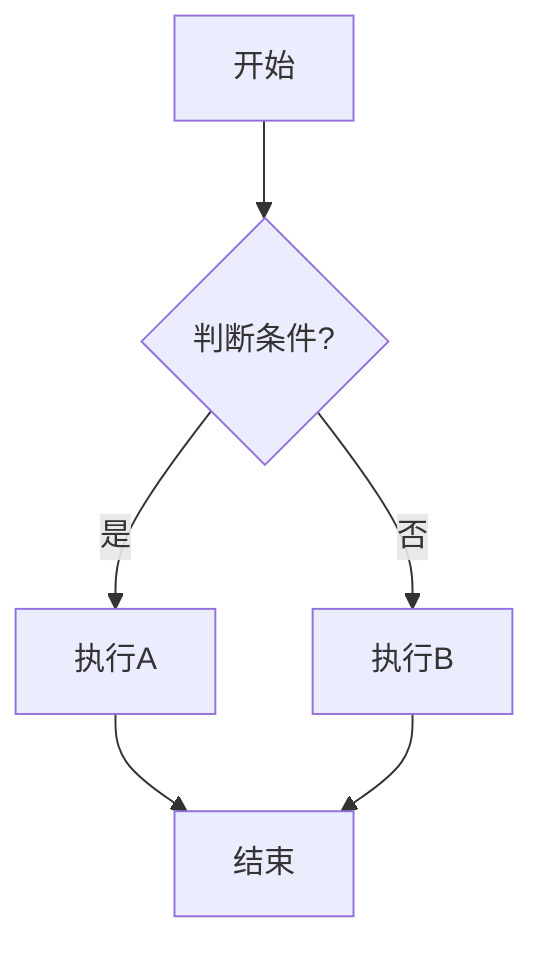
````

节点形状：

| 语法 | 形状 |
|------|------|
| `A[矩形]` | 矩形（默认） |
| `A(圆角矩形)` | 圆角矩形 |
| `A([体育场形])` | 体育场形 |
| `A[[子程序]]` | 子程序形 |
| `A[(数据库)]` | 圆柱形 |
| `A((圆形))` | 圆形 |
| `A{菱形}` | 菱形（判断） |
| `A{{六边形}}` | 六边形 |
| `A[/平行四边形/]` | 平行四边形 |
| `A[\反平行四边形\]` | 反平行四边形 |
| `A[/梯形\]` | 梯形 |
| `A[\反梯形/]` | 反梯形 |

连线类型：

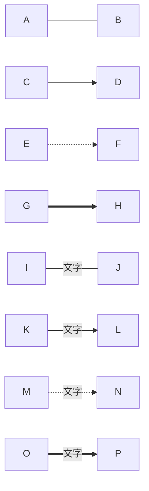

方向：`TB`（上→下）/ `TD`（同TB）/ `BT`（下→上）/ `LR`（左→右）/ `RL`（右→左）

子图：

````markdown
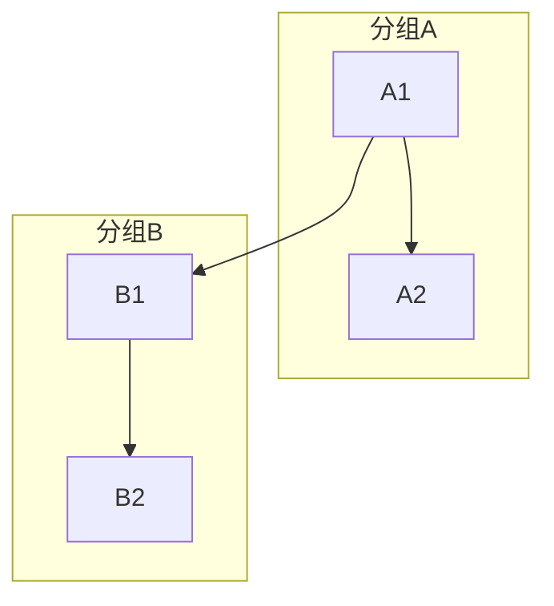
````


---

### 时序图（Sequence Diagram）

````markdown
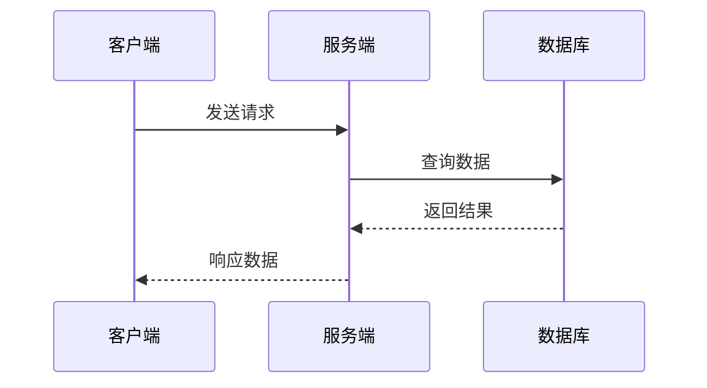
````


箭头类型：

| 语法 | 含义 |
|------|------|
| `->>` | 实线箭头 |
| `-->>` | 虚线箭头 |
| `-)` | 实线异步 |
| `--)` | 虚线异步 |
| `-x` | 实线 + X 结尾 |
| `--x` | 虚线 + X 结尾 |

激活/停用：

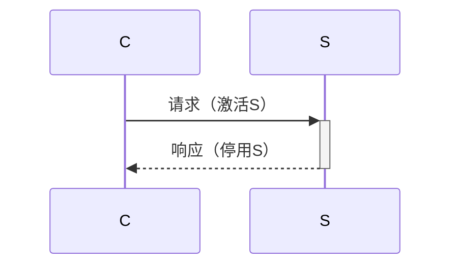

Note 注释：

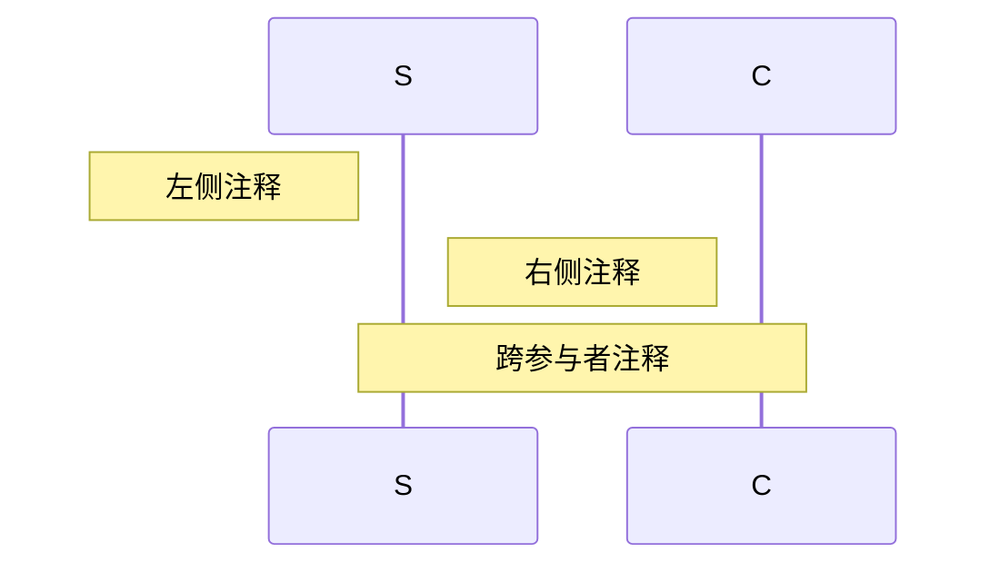

Loop / Alt / Opt：

````markdown
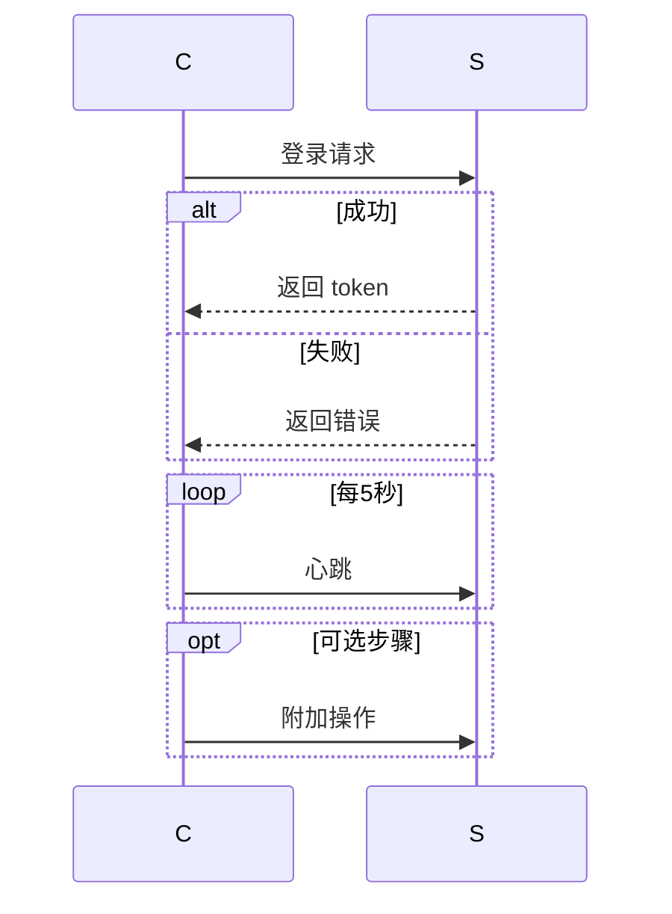
````

---

### 类图（Class Diagram）

````markdown
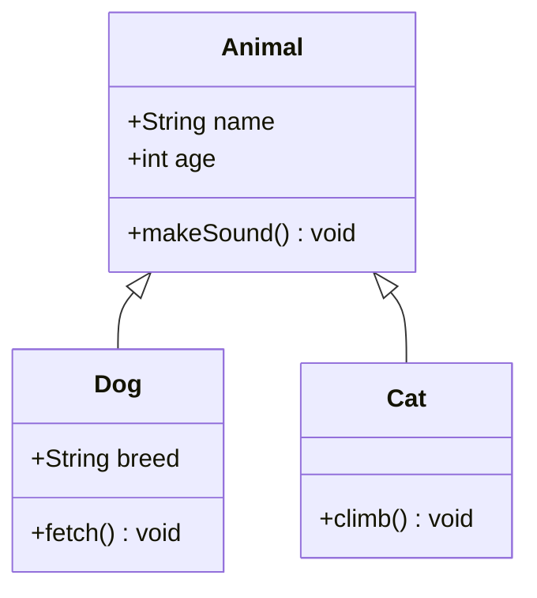
````


可见性：`+` public / `-` private / `#` protected / `~` package

关系类型：

| 语法 | 关系 | 说明 |
|------|------|------|
| `A <\|-- B` | 继承 | B 继承 A |
| `A *-- B` | 组合 | B 由 A 组成（强依赖） |
| `A o-- B` | 聚合 | B 聚合到 A（弱依赖） |
| `A --> B` | 关联 | A 关联 B |
| `A -- B` | 连线 | 无箭头连线 |
| `A ..> B` | 依赖 | A 依赖 B |
| `A <\|.. B` | 实现 | B 实现 A 接口 |

---

### 状态图（State Diagram）

````markdown
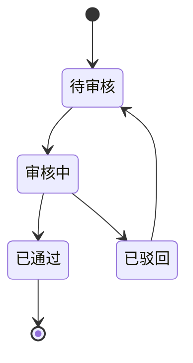
````


复合状态：

````markdown
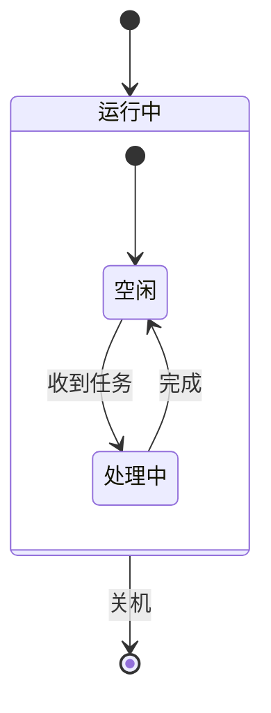
````

---

### 甘特图（Gantt Chart）

````markdown
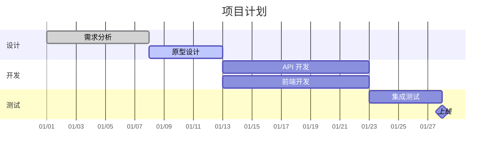
````

状态标记：`done` / `active` / `crit`（关键）/ `milestone`（里程碑，duration 为 0d）

---

### 饼图（Pie Chart）

````markdown
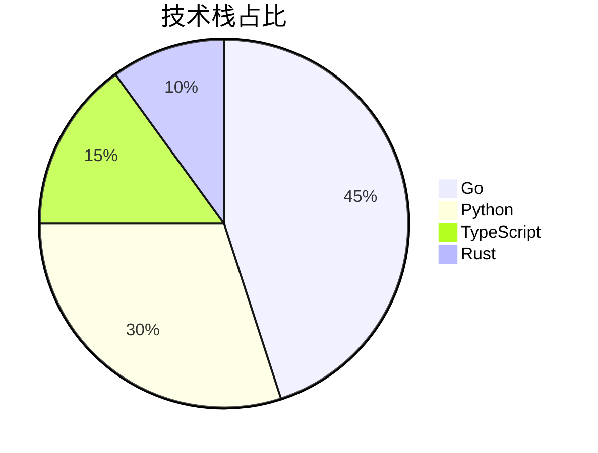
````


---

### ER 图（Entity Relationship Diagram）

````markdown
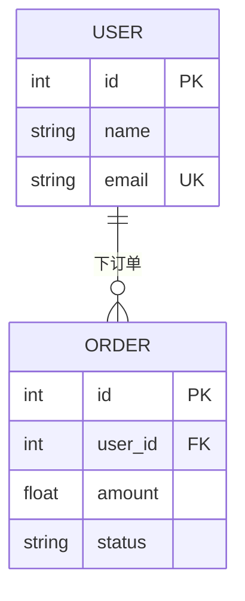
````


关系基数：

| 语法 | 含义 |
|------|------|
| `\|` | 一 |
| `o` | 零 |
| `}` | 多 |
| `\|o` | 一或零 |
| `o\|` | 零或一 |
| `}\|` | 一或多 |
| `\|{` | 一或多 |
| `}o` | 零或多 |
| `o{` | 零或多 |

---

### Git 图（Git Graph）

````markdown
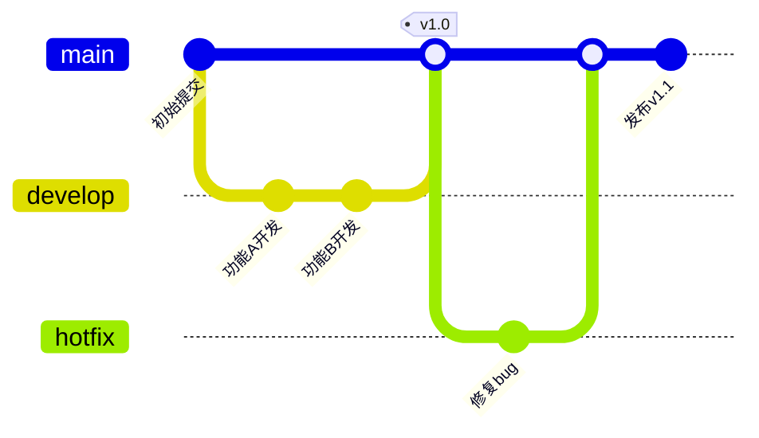
````

```mermaid
gitGraph
    commit id: "初始提交"
    branch develop
    checkout develop
    commit id: "功能A开发"
    commit id: "功能B开发"
    checkout main
    merge develop tag: "v1.0"
    branch hotfix
    checkout hotfix
    commit id: "修复bug"
    checkout main
    merge hotfix
    commit id: "发布v1.1"
```

`commit` 可选属性：`id` `tag` `type: HIGHLIGHT` `type: REVERSE`

---

### 用户旅程图（User Journey）

````markdown
```mermaid
journey
    title 用户购物流程
    section 浏览
      打开首页: 5: 用户
      搜索商品: 4: 用户
      筛选结果: 3: 用户
    section 购买
      加入购物车: 5: 用户
      填写地址: 3: 用户
      支付: 5: 用户, 系统
    section 售后
      查看物流: 4: 用户
      确认收货: 5: 用户
```
````

格式：`任务名: 评分(1-5): 参与者`

---

### 思维导图（Mindmap）

````markdown
```mermaid
mindmap
  root((Markdown))
    标准语法
      标题
      列表
      链接
      图片
      代码
    扩展语法
      表格
      脚注
      任务列表
      数学公式
      图表
        Mermaid
          flowchart
          sequenceDiagram
          classDiagram
          stateDiagram
          gantt
          pie
          erDiagram
          gitGraph
```
````

---

## Emoji

```markdown
:smile: :+1: :tada: :rocket: :warning: :bulb:
```

| 短码 | 效果 | 短码 | 效果 |
|------|------|------|------|
| `:smile:` | 😄 | `:heart:` | ❤️ |
| `:+1:` | 👍 | `:-1:` | 👎 |
| `:tada:` | 🎉 | `:rocket:` | 🚀 |
| `:warning:` | ⚠️ | `:bulb:` | 💡 |
| `:fire:` | 🔥 | `:bug:` | 🐛 |
| `:sparkles:` | ✨ | `:memo:` | 📝 |

---

## 平台兼容性

| 语法 | 标准MD | GFM | Obsidian | Typora | Hugo(默认) |
|------|:---:|:---:|:---:|:---:|:---:|
| 标题/列表/链接/图片 | ✅ | ✅ | ✅ | ✅ | ✅ |
| 代码块/引用 | ✅ | ✅ | ✅ | ✅ | ✅ |
| 表格 | — | ✅ | ✅ | ✅ | ✅ |
| 任务列表 | — | ✅ | ✅ | ✅ | ✅ |
| 删除线 | — | ✅ | ✅ | ✅ | ✅ |
| 脚注 | — | — | ✅ | ✅ | ✅ |
| 数学公式 | — | — | ✅ | ✅ | 需配置 |
| Mermaid | — | ✅ | ✅ | ✅ | 需配置 |
| Emoji 短码 | — | ✅ | ✅ | ✅ | — |
| Wiki 链接 | — | — | ✅ | — | — |

---

## 常见错误

```markdown
#❌ #后无空格
✓ # 正确

❌ 块级元素间无空行
✓ 元素间加空行

❌ 嵌套缩进不足
✓ 子项缩进2空格

❌ 代码块内外反引号数量相同
✓ 外层比内层多至少1个

❌ 表格缺分隔行 |---|
✓ 必须有 |---|---| 行

❌ 引用空行缺 >
✓ 空行也写 >

❌ 图片 Windows 反斜杠路径
✓ 全部用 /

❌ 链接 URL 含未转义括号
✓ 用 <url> 包裹
```
