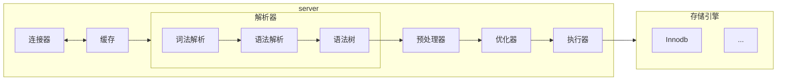

# 前言

在使用很久Mysql后回来补充八股知识了

## 下载启动

这里只讲docker：
```bash
docker pull mysql:8.0
docker run -d --name mysql -p 3306:3306 -e MYSQL_ROOT_PASSWORD=123456\
-v mysql-data:/var/lib/mysql\
--restart always\
mysql:8.0
```
进入：
```bash
docker exec -it mysql
```

## 指令

```bash
mysqlsh #进入mysqlsh客户端
mysql -h 127.0.0.1 -p 3306 -u root -p #传统命令行客户端,注意mysqlsh默认33060使用X协议
mysqldump -u root -p mifi test --where="id > 1000" > test.sql #将mifi库中的test表中的id大于1000的数据导出到test.sql中
mysql -u root -p mifi < test.sql #将表数据导入到mifi数据库中
SOURCE /path/to/dump.sql; #登录后也可以USE XXX然后通过这个导入
```
进入后
```bash
\help
\use xxx #使用xxx数据库
\sql #使用sql语法
\connect root@localhost #连接数据库
show processlist; #查看当前mysql服务被多少客户端连接
show variables like 'wait_timeout'; #查看空闲时长
show variables like 'max_connections'; #查看最大连接数
kill connection +6; #断开id为6的连接
```

## SQL

语句
```sql
SHOW DATABASES; --查看库
CREATE DATABASE XXX; --创建XXX数据库
DROP DATABASE XXX; --删除XXX数据库
SELECT DATABASE(); --查看当前使用的数据库
USE XXX; --使用XXX数据库
SHOW TABLES; --查看当前数据库表
CREATE TABLE YYY (
  id INT,
  name VARCHAR(100),
  gold DECIMAL(10,2),
  exp INT
);
--创建YYY表
DESC YYY; --查看表结构
ALTER TABEL YYY MODIFY COLUMN name VARCHART(200) DEFAULT 'A'; --为YYY表修改name类型为VARCHAR(200)，默认值为'A'
ALTER TABEL YYY RENAME COLUMN name TO nick_name; --为YYY表修改name名为nick_name
ALTER TABLE YYY ADD COLUMN last_login DATETIME; --为YYY表添加列last_login,类型为datetime
ALTER TABLE YYY DROP COLUMN last_login; --删除YYY表中的last_login字段
DROP TABLE YYY; -- 删除YYY表
INSERT INTO YYY (id,name) VALUES (1,'mifi'); --向表添加数据，如果含所有列且顺序一致可以省略前面列的()，可以插入多条数据，用,隔开
SELECT * FROM YYY; --查询YYY表中的数据，*表示任意
UPDATE YYY SET NAME = 'B' WHERE NAME='A'; --将表YYY中name为'A'的行中的name修改为B
DELETE FROM YYY WHERE name='B'; --删除YYY表中name='B'的行
SELECT * FROM YYY WHERE id > 1 AND id <9; --查看id>1,id<9的行
SELECT * FROM YYY WHERE id > 1 OR name = 'A'; --查看id>1或name='A'的行
SELECT * FROM YYY WHERE id  IN (1,3,5); --查找id为1，3，5的行
SELECT * FROM YYY WHERE id BETWEEN 1 AND 10; --查找id在1到10的行
SELECT * FROM YYY WHERE id NOT BETWEEN 1 AND 10; --查找id不在1到10的行
SELECT * FROM YYY WHERE name LIKE '王%'; --查找所有name以王开头的行，%表示任意个字符，_表示任意一个字符
SELECT * FROM YYY WHERE name REGEXP '^王.$'; --匹配正则表达式
SELECT * FROM YYY WHERE name IS NULL; --查找name为空的行
SELECT * FROM YYY ORDER BY id ASC; --按id升序排列获取行
SELECT * FROM YYY ORDER BY id DESC; --按id降序排列获取行
SELECT * FROM YYY ORDER BY id DESC,exp ASC,; --按id降序排列,如果id一致则按exp升序获取行
SELECT COUNT(*) FROM YYY; --获取YYY表所有行的数量
SELECT exp,COUNT(exp) FROM YYY GROUP BY exp HAVING COUNT(exp) > 4; --按exp分组并获取exp值与对应数量,并只要exp大于4的数据
SELECT exp,COUNT(exp) FROM YYY GROUP BY exp LIMIT 3,3; --按exp分组并获取第三至第六的行
SELECT DISTINCT exp FROM YYY;  --查找将exp去重后的结果
UNION --连接两个sql语句，合并结果，且会去重重复结果
INTERSECT --相比于UNION，其用来查询交集
EXCEPT --用来查询差集
-- 子查询，通过嵌套SELECT等实现多层查询
```

## 八股

来自小林coding，讲的确实好，挺有趣的。🙂

先看架构：


### 连接

连接中用户权限不变，管理员修改不影响当前连接。连接有默认最大空闲时长，大于会断开（默认为八小时）。mysql采用TCP协议长连接，所以会出现长时间占用内存，解决方案：
- 定期断开
- 客户端主动重置:msyql有可以通过重置连接释放内存而不重连的办法

缓存这个好像已经没有了（没什么用的原因）。

解析器这里很像Go语言，表和其中字段存不存不在这里处理。

执行SQL需要先预处理，后优化，最后执行。预处理阶段比如会将*改为实际表的字段等，优化器用来决定是否使用索引等，在最前面添加explain分析执行计划。

经过不断询问ai，浅浅讲解下mysql底层B+树：

大概长这样，一个索引构建一棵树，实际上各个节点还有槽用来快速在页中查找对应行，后续会介绍，可以话去看小林的，我主要是记点笔记方便自己看。先知道结构有：段，区，页，行即可，槽会指向某页中最小和最大的行（如果是非叶节点则会指向最小和最大页），其中都是有序的。
```
        根页（非叶节点，1页）
         [10 | 50 | 100]
        /      |      \
   非叶页    非叶页    非叶页
  [1|5]    [20|30]  [60|80]
   / \       / \      / \
叶页 叶页  叶页 叶页  叶页 叶页
数据 数据  数据 数据  数据 数据
```
B+树特点就是用链表将不同分支的节点连接起来了，方便顺序查找。
