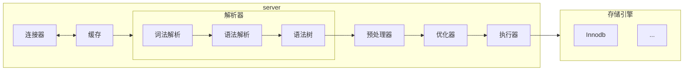

# 前言

在使用很久Mysql后回来补充八股知识了

## 下载启动

这里只讲docker：
```bash
docker pull mysql:8.0
docker run -d --name mysql -p 3306:3306 -e MYSQL_ROOT_PASSWORD=123456\
-v mysql-data:/var/lib/mysql\
--restart always\
mysql:8.0
```
进入：
```bash
docker exec -it mysql
```

## 指令

```bash
mysqlsh #进入mysqlsh客户端
mysql -h 127.0.0.1 -p 3306 -u root -p #传统命令行客户端,注意mysqlsh默认33060使用X协议
mysqldump -u root -p mifi test --where="id > 1000" > test.sql #将mifi库中的test表中的id大于1000的数据导出到test.sql中
mysql -u root -p mifi < test.sql #将表数据导入到mifi数据库中
SOURCE /path/to/dump.sql; #登录后也可以USE XXX然后通过这个导入
```
进入后
```bash
\help
\use xxx #使用xxx数据库
\sql #使用sql语法
\connect root@localhost #连接数据库
show processlist; #查看当前mysql服务被多少客户端连接
show variables like 'wait_timeout'; #查看空闲时长
show variables like 'max_connections'; #查看最大连接数
kill connection +6; #断开id为6的连接
```

## SQL

语句
```sql
SHOW DATABASES; --查看库
CREATE DATABASE XXX; --创建XXX数据库
DROP DATABASE XXX; --删除XXX数据库
SELECT DATABASE(); --查看当前使用的数据库
USE XXX; --使用XXX数据库
SHOW TABLES; --查看当前数据库表
CREATE TABLE YYY (
  id INT,
  name VARCHAR(100),
  gold DECIMAL(10,2),
  exp INT
);
--创建YYY表
DESC YYY; --查看表结构
ALTER TABEL YYY MODIFY COLUMN name VARCHART(200) DEFAULT 'A'; --为YYY表修改name类型为VARCHAR(200)，默认值为'A'
ALTER TABEL YYY RENAME COLUMN name TO nick_name; --为YYY表修改name名为nick_name
ALTER TABLE YYY ADD COLUMN last_login DATETIME; --为YYY表添加列last_login,类型为datetime
ALTER TABLE YYY DROP COLUMN last_login; --删除YYY表中的last_login字段
DROP TABLE YYY; -- 删除YYY表
INSERT INTO YYY (id,name) VALUES (1,'mifi'); --向表添加数据，如果含所有列且顺序一致可以省略前面列的()，可以插入多条数据，用,隔开
SELECT * FROM YYY; --查询YYY表中的数据，*表示任意
UPDATE YYY SET NAME = 'B' WHERE NAME='A'; --将表YYY中name为'A'的行中的name修改为B
DELETE FROM YYY WHERE name='B'; --删除YYY表中name='B'的行
SELECT * FROM YYY WHERE id > 1 AND id <9; --查看id>1,id<9的行
SELECT * FROM YYY WHERE id > 1 OR name = 'A'; --查看id>1或name='A'的行
SELECT * FROM YYY WHERE id  IN (1,3,5); --查找id为1，3，5的行
SELECT * FROM YYY WHERE id BETWEEN 1 AND 10; --查找id在1到10的行
SELECT * FROM YYY WHERE id NOT BETWEEN 1 AND 10; --查找id不在1到10的行
SELECT * FROM YYY WHERE name LIKE '王%'; --查找所有name以王开头的行，%表示任意个字符，_表示任意一个字符
SELECT * FROM YYY WHERE name REGEXP '^王.$'; --匹配正则表达式
SELECT * FROM YYY WHERE name IS NULL; --查找name为空的行
SELECT * FROM YYY ORDER BY id ASC; --按id升序排列获取行
SELECT * FROM YYY ORDER BY id DESC; --按id降序排列获取行
SELECT * FROM YYY ORDER BY id DESC,exp ASC,; --按id降序排列,如果id一致则按exp升序获取行
SELECT COUNT(*) FROM YYY; --获取YYY表所有行的数量
SELECT exp,COUNT(exp) FROM YYY GROUP BY exp HAVING COUNT(exp) > 4; --按exp分组并获取exp值与对应数量,并只要exp大于4的数据
SELECT exp,COUNT(exp) FROM YYY GROUP BY exp LIMIT 3,3; --按exp分组并获取第三至第六的行
SELECT DISTINCT exp FROM YYY;  --查找将exp去重后的结果
UNION --连接两个sql语句，合并结果，且会去重重复结果
INTERSECT --相比于UNION，其用来查询交集
EXCEPT --用来查询差集
-- 子查询，通过嵌套SELECT等实现多层查询
```

## 八股

来自小林coding，讲的确实好，挺有趣的。🙂

先看架构：


### 连接

连接中用户权限不变，管理员修改不影响当前连接。连接有默认最大空闲时长，大于会断开（默认为八小时）。mysql采用TCP协议长连接，所以会出现长时间占用内存，解决方案：
- 定期断开
- 客户端主动重置:msyql有可以通过重置连接释放内存而不重连的办法

缓存这个好像已经没有了（没什么用的原因）。

解析器这里很像Go语言，表和其中字段存不存不在这里处理。

执行SQL需要先预处理，后优化，最后执行。预处理阶段比如会将*改为实际表的字段等，优化器用来决定是否使用索引等，在最前面添加explain分析执行计划。可以知道有：直接使用索引，二级索引，联合索引，回表等操作，简而言之就是尽可能使用索引直接获取结果并减少回表操作即可。

经过不断询问ai，浅浅讲解下mysql底层B+树：

大概长这样，一个索引构建一棵树，实际上各个节点还有槽用来快速在页中查找对应行，后续会介绍，可以话去看小林的，我主要是记点笔记方便自己看。先知道结构有：段，区，页，行即可，槽会指向某页中最小和最大的行（如果是非叶节点则会指向最小和最大页），其中都是有序的。
```
        根页（非叶节点，1页）
         [10 | 50 | 100]
        /      |      \
   非叶页    非叶页    非叶页
  [1|5]    [20|30]  [60|80]
   / \       / \      / \
叶页 叶页  叶页 叶页  叶页 叶页
数据 数据  数据 数据  数据 数据
```
B+树特点就是用双向链表将不同分支的节点连接起来了，方便顺序查找。，注意不是说索引树会将所有的页记录，比如溢出页等是不会存在在树中的，B+树的本质意义是建立索引方便查找。

而具体大概是：

目录在/var/lib/mysql/xxx，xxx为库的名称，其中有三种文件：
```bash
db.opt #存储数据库的默认字符集和字符校验规则
t_order.frm #表结构会保存在这个文件
t_order.ibd #表数据会保存在这个文件
#t_order为xxx库中的表
```

页：数据库读取时按页为单位读写，默认每个页大小为16KB，每个区大小为1MB，当索引分配空间不够时按区新增。对于 16KB 的页来说，连续的 64 个页会被划为一个区，这样就使得链表中相邻的页的物理位置也相邻，就能使用顺序 I/O 了。首先要知道的是数据库或操作系统不会直接操作物理硬盘，操作的是LBA（LBA 全称 Logical Block Address，逻辑块地址。），目的主要是讲多次LBA读取合成一个大请求从而减少操作。顺序 I/O 的本质：不是“物理上一定挨着”，而是“逻辑上连续的大块请求，减少小请求开销”。

段：
- 索引段：非叶节点
- 数据段：叶节点
- 回滚段：回滚数据的区的集合，用于事务隔离

事务隔离：

简要：

- 持久性是通过 redo log （重做日志）来保证的；
- 原子性是通过 undo log（回滚日志） 来保证的；
- 隔离性是通过 MVCC（多版本并发控制） 或锁机制来保证的；
- 一致性则是通过持久性+原子性+隔离性来保证；

隔离级别：
- 读未提交（read uncommitted），指一个事务还没提交时，它做的变更就能被其他事务看到；
- 读提交（read committed），指一个事务提交之后，它做的变更才能被其他事务看到；
- 可重复读（repeatable read），指一个事务执行过程中看到的数据，一直跟这个事务启动时看到的数据是一致的，MySQL InnoDB 引擎的默认隔离级别；
- 串行化（serializable ）；会对记录加上读写锁，在多个事务对这条记录进行读写操作时，如果发生了读写冲突的时候，后访问的事务必须等前一个事务执行完成，才能继续执行；

数据库默认为可重复读，依靠read-view机制实现，一个read-view：
```bash
creator_trx_id #创建该事务的id 
m_ids #创建时活跃且为提交的事务id
min_trx_id #m_idx最小的id
max_trx_id #下一个要分配的id
```
规则：
- 如果记录id小于当前A事务id则对当前A事务可见
- 如果大于则不可见
- 之间的话，如果在活跃id中则不可见，否则则可见（可重复读下当事务提交其活跃键依旧在m_ids中，所以即使B事务在A事务中已提交其A事务的m_ids依旧存在）

行格式：现在采用的Dynamic ，讲下 Compact 行格式。（其实是小林coding只讲了这个）

变长字段长度列表-NULL值列表-记录头信息-数据列-列值

一个是每次读取是从数据列左开始，方便左移即额外信息，右移则数据。所以额外信息部分是反过来的即逆序存放。还有个原因是为了提升缓存命中率。为了加快八股学习速度，这里直接放链接:[CPU缓存](https://xiaolincoding.com/os/1_hardware/how_to_make_cpu_run_faster.html#%E5%A6%82%E4%BD%95%E6%8F%90%E5%8D%87%E6%8C%87%E4%BB%A4%E7%BC%93%E5%AD%98%E7%9A%84%E5%91%BD%E4%B8%AD%E7%8E%87)，简而言之就是尽可能让需要读取的数据在一起，CPU一次加载一个完整Cache Line。

NULL值列表中每个列对应一个二进制位（bit），二进制位按照列的顺序逆序排列。1表示为NULL。

记录头中：
- row_id：默认主键，当没有指明时存在
- rex_id：事务id
- 上一个版本行的指针

varchar(n)中n最大值：其他所有的列（不包括隐藏列和记录头信息）占用的字节长度加起来不能超过 65535 个字节。

当发生行溢出后，多的数据会存储在溢出页，真实数据处用 20 字节存储指向溢出页的地址。

主键，默认会使用主键作为聚簇索引的索引键（key）.其它索引都属于辅助索引（Secondary Index），也被称为二级索引或非聚簇索引。

回表：当使用二级索引时，如果二级索引没有要查询的数据则会使用二级索引对应的主键id回到主索引树查询。联合索引是依次排序，所以使用联合索引时需要确保顺序。

为什么Mysql使用B+树：

1. 只在叶子节点存储数据，查询更快
2. 使用双链表，适合范围的顺序查找
3. 矮，减少I/O次数

索引：
- 唯一索引：建立在 UNIQUE 字段上的索引,一个表可以又多个唯一索引
  ```sql
  CREATE UNIQUE INDEX index_name
  ON table_name(index_column_1,index_column_2,...); 
  ```
- 普通索引:
  ```sql
  CREATE INDEX index_name
  ON table_name(index_column_1,index_column_2,...); 
  ```
- 前缀索引:为了减少索引占用的存储空间，提升查询效率(对字符类型字段的前几个字符建立的索引)
  ```sql
  CREATE INDEX index_name
  ON table_name(column_name(length)); 
  ```
- 联合索引：上面讲过(最左匹配原则)
  ```sql
  CREATE INDEX index_product_no_name ON product(product_no, name);
  <!-- 范围查询的字段可以用到联合索引，但是在范围查询字段的后面的字段无法用到联合索引。 -->
  ```
  我讲解下，实际上是如果a>2,b=2查找是先偏离表所有a>2的然后在索引层过滤，仍然遍历了所有b的数据，当a的范围很小时有可能对每个a用二分查找b=2，所以优化为使用
  ```sql
  WHERE a IN (2,3,4) AND b = 2
  ```
  这样优化器会拆分为多个等值区间
