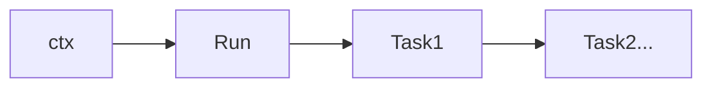

# 前言

学习下chromedp框架尝试网页自动化
## 导入

```go
import "github.com/chromedp/chromedp"
```

## 原理结构


## 基本结构


```go
ctx, cancel := chromedp.NewContext(context.Background())
defer cancel()

err := chromedp.Run(ctx,
    chromedp.Navigate("https://google.com"),
)
```
一个**ctx**启动一个**TAB**:

```go
ctx, cancel := chromedp.NewContext(context.Background())
ctx2, _ := chromedp.NewContext(ctx)
```

## ___Run()___

在Run中对网页进行操作，如:
```go
chromedp.Run(ctx,

    chromedp.Navigate(url),

    chromedp.WaitVisible("#login"),

    chromedp.Click("#login"),

    chromedp.Sleep(time.Second),
)
```
将会依次进行
