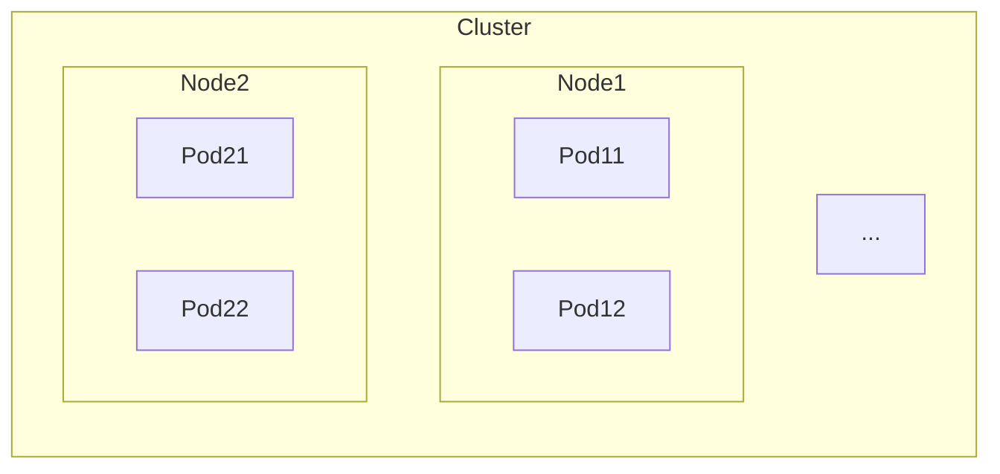

# 前言

# 架构


## 架构理解


# 应用

## YAML配置

### Pod配置
```yaml
apiVersion: v1 #api版本
kind: Pod #资源类型
metadata: #填写关于这个对象的标识
  name: nginx-pod #为pod命名
  labels: #添加标签
    app: nginx
spec:
  containers: #创建容器，注意一般只会一个pod一个容器
    - name: nginx-container
      image: nginx 
    - name: loki
      image: grafana/loki
```
### ReplicaSet配置：  
  用来维持pod数量
```yaml
apiVersion: apps/v1
kind: ReplicaSet #如果Deployment可以更改配置以更新所有pod
metadata:
  name: nginx-replicaset
  lables:
    name: nginx-replica
spec:
  replicas: 4 #维持的pod数量
  selector:
    matchLabels: #匹配的标签
      app: nginx #匹配`app: nginx`标签
    template: #创建模板，以下为模板，当pod不够时用该模板创建
      metadata:
        name: nginx-pod 
        labels:
          app: nginx
      spec:
        containers:
          - name: nginx-container
            image: nginx 
          - name: loki
            image: grafana/loki
```

### Service配置
用于提供接口供它调用
- NodePort：提供接口供外部调用
- ClusterIP：提供IP供
```yaml
apiVersion: v1
kind: Service
metadata:
  name: external-service
spec:
  type: NodePort #定义Service类型
  selector:
    app: nginx #匹配标签的pod
  ports:
    - port: 80 #节点中某Service的端口号
      targetPort: 80 #Service中某pod的端口号
      nodePort: 30008 #节点对外暴露的端口，范围要求：30000-32767
```
## 指令

```bash
kubectl get pods #查看当前pod
kubectl delete pod xxx #删除xxxpod
kubctl run xxx -i --tty --image=yyy #运行一个已yyy为镜像的xxxpod
kubectl create -f ddd.yml #通过ddd.yaml创建pod
kubectl replace -f ddd.yml #使用ddd.yml代替原来的pod
kubectl get rs #查看replicaset的缩写
kubectl scale --replicas=5 -f ddd.yml #更改replicas为5并应用到ddd.yml上
kubectl apply -f ddd.yml #应用ddd.yml
kubectl get services #查看当前service
```
