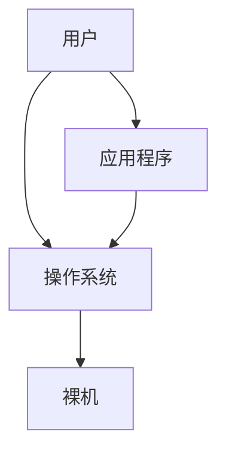

## 1. 计算机系统概述

### 1.1 操作系统的概念、功能和目标

#### 1.1.1+1.1.2 操作系统的概念、功能和目标

结构：

*操作系统*：控制和管理计算机系统的硬件和软件资源，组织调度计算机的工作和资源分配以提供给用户和其他软件方便的接口和环境，是系统最基础的系统软件

功能：
- 处理器管理
- 存储器管理
- 文件管理
- 设备管理
- ......

一些服务：
- GUI（比如windows的图形拖拽）
- 命令接口：
  - 联机命令接口（交互式命令接口）
  - 脱机命令接口（批处理命令接口）
- 程序接口，通过系统调用所有程序接口（比如C++中std::cout<<"hello world"实际调用的系统的接口）
- ......

#### 1.1.3 操作系统的特征

特征：
- 并发
  - 并发：同一时刻间隔发送，微观上交替发生
  - 并行：同时发生
- 共享：
  - 互斥共享方式
  - 同时共享方式
- 虚拟
- 异步

### 1.2 操作系统的发展与分类

### 1.3 操作系统的运行机制

#### 1.3.1 操作系统的运行机制

#### 1.3.2 中断和异常

#### 1.3.3 系统调用

### 1.4 操作系统体系结构

#### 1.4 操作系统体系结构（上）

#### 1.4 操作系统体系结构（下）

### 1.5 操作系统引导

### 1.6 虚拟机

## 2. 进程与线程

### 2.1 进程与线程

#### 2.1.1+2.1.2 进程的概念、组成、特征

#### 2.1.3 进程的状态与转换

#### 2.1.4 进程控制

#### 2.1.5 进程通信

##### 2.1.5_1 进程通信

##### 2.1.5_2 信号

#### 2.1.6 线程

##### 2.1.6_1 线程的概念与特点

##### 2.1.6_2 线程的实现方式和多线程模型

##### 2.1.6_3 线程的状态与转换

### 2.2 处理机调度

#### 2.2.1 调度的概念、层次

#### 2.2.2 进程调度的时机、切换与过程、方式

##### 2.2.2_1+2.2.4 进程调度的时机、切换与过程、方式

##### 2.2.2_2 调度器和闲逛进程

#### 2.2.3 调度的目标（调度算法的评价指标）

#### 2.2.5 调度算法

##### 2.2.5_1 调度算法：先来先服务、最短作业优先、最高响应比优先

##### 2.2.5_2 调度算法：时间片轮转、优先级、多级反馈队列

##### 2.2.5_3 调度算法：多级队列调度算法

#### 2.2.6 多处理机调度

### 2.3 进程同步与互斥

#### 2.3.1 同步与互斥的基本概念

#### 2.3.2 进程互斥的实现方法

##### 2.3.2_1 进程互斥的软件实现方法

##### 2.3.2_2 进程互斥的硬件实现方法

#### 2.3.3 互斥锁

#### 2.3.4 信号量机制

##### 2.3.4_1 信号量机制

##### 2.3.4_2 用信号量实现进程互斥、同步、前驱关系

#### 2.3.5 经典同步问题

##### 2.3.5_1_1 生产者-消费者问题

##### 2.3.5_1_2 多生产者-多消费者问题

##### 2.3.5_2 读者-写者问题

##### 2.3.5_3 哲学家进餐问题

#### 2.3.6 管程

### 2.4 死锁

#### 2.4.1 死锁的概念

#### 2.4.2 死锁的处理策略—预防死锁

#### 2.4.3 死锁的处理策略—避免死锁

#### 2.4.4 死锁的处理策略—检测和解除

## 3. 内存管理

### 3.1 内存管理基础

#### 3.1.1 内存的基础知识

##### 3.1.1_1 内存的基础知识

##### 3.1.1_2 内存管理的概念

##### 3.1.1_3 进程的内存映像

##### 3.1.1_4 (选修）覆盖与交换

#### 3.1.2 连续分配管理方式

##### 3.1.2_1 连续分配管理方式

##### 3.1.2_2 动态分区分配算法

#### 3.1.3 分页存储管理

##### 3.1.3_1 基本分页存储管理的概念

##### 3.1.3_2 基本地址变换机构

##### 3.1.3_3 具有快表的地址变换机构

##### 3.1.3_4 两级页表

#### 3.1.4 基本分段存储管理方式

#### 3.1.5 段页式管理方式

### 3.2 虚拟内存

#### 3.2.1 虚拟内存的基本概念

#### 3.2.2 请求分页管理方式

#### 3.2.4 页面置换算法

#### 3.2.5+3.2.3 页面分配策略

#### 3.2.7 内存映射文件

## 4. 文件管理

### 4.1 文件系统基础

#### 4.1_1 初识文件管理

#### 4.1_2 文件的逻辑结构

#### 4.1_3 文件目录

#### 4.1_4 文件的物理结构

##### 4.1_4 文件的物理结构（上）

##### 4.1_4 文件的物理结构（下）

#### 4.1_5 逻辑结构VS物理结构

#### 4.1_6 文件存储空间管理

#### 4.1_7 文件的基本操作

#### 4.1_8 文件共享

#### 4.1_9 文件保护

### 4.3 文件系统

#### 4.3_1 文件系统的层次结构

#### 4.3_2 文件系统布局

#### 4.3_4 虚拟文件系统

## 5. 输入/输出（I/O）管理

### 5.1 I/O管理概述

#### 5.1_1 I-O设备的概念和分类

#### 5.1.2 I-O控制器

#### 5.1_3 IO控制方式

#### 5.1_4 I-O软件层次结构

#### 5.1_5 输入输出应用程序接口和驱动程序接口

### 5.2 I/O核心子系统

#### 5.2_1 IO核心子系统

#### 5.2_2 假脱机技术

#### 5.2_3 设备的分配与回收

#### 5.2_4 缓冲区管理

### 5.3 磁盘与固态硬盘

#### 5.3_1 磁盘的结构

#### 5.3_2 磁盘的管理

#### 5.3_3 磁盘调度算法

#### 5.3_3 减少磁盘延迟时间的方法

#### 5.3.4 固态硬盘

