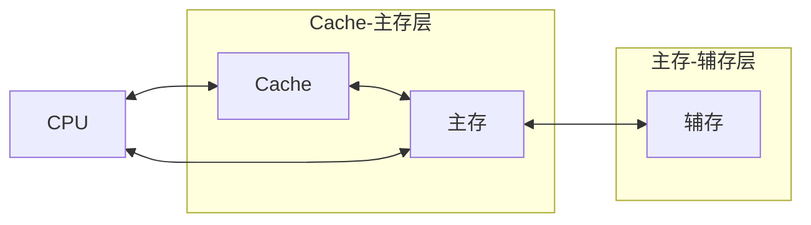
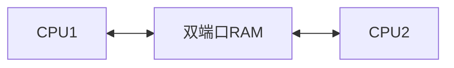

## 1.0 你好，我是计算机组成原理

## 1.1 计算机的发展

## 1.2 计算机硬件系统

从硬件的基本组成讲起，逐层拆解各硬件的工作原理、计算机软件的分类，最后归纳计算机系统的层次结构与整机工作原理。

### 1.2.1+1.2.2 计算机硬件的基本组成

### 1.2.2 各个硬件的工作原理

### 1.2.3 计算机软件

### 1.2.4 计算机系统的层次结构

### 1.2.5 计算机系统的工作原理

## 1.3 计算机的性能指标

## 2.1 数制与编码

介绍进位计数制与各种编码（原码、反码、补码、移码），并结合 C 语言讲解整数类型、类型转换以及零扩展和符号扩展。

### 2.1.1 进位计数制

### 2.1.2+2.1.3 定点数的编码表示

### 2.1.2+2.1.3（拓展）各种码的作用

### 2.1.4 C语言中的整数类型

结合 C 语言讲解整数类型及类型转换，以及零扩展与符号扩展的区别。

#### 2.1.4 1 C语言中的整数类型及类型转换

#### 2.1.4 2 零扩展、符号扩展

## 2.2 运算方法

先补充数字电路基础（逻辑门、多路选择器、三态门），再讲解加法器与 ALU，最后覆盖定点数的移位、加减、乘除运算原理。

### 2.2.0 数字电路基础补充

补充讲解逻辑门电路，以及多路选择器、三态门等数字电路基础。

#### 2.2.0 1 逻辑门电路（数字电路基础补充）

#### 2.2.0 2 多路选择器、三态门（数字电路基础补充）

### 2.2.1 加法器与ALU

讲解加法器（串行、并行）的实现原理，以及算数逻辑单元 ALU 的组成。

#### 2.2.1 1 加法器

#### 2.2.1 3 算数逻辑单元ALU

### 2.2.2 定点数的移位运算

### 2.2.3 定点数的加减运算

讲解定点数（含无符号数）加减运算的规则，以及补码加减运算电路的实现。

#### 2.2.3 1 定点数的加减运算

#### 2.2.3 2 无符号数的加减运算

#### 2.2.3 3 补码加减运算电路

### 2.2.4 乘除法运算

讲解无符号整数和带符号整数的乘除法运算原理，以及计算机实现乘法的三种方式。

#### 2.2.4 0 乘法除法运算复习说明（书课适配说明）

#### 2.2.4 1 无符号整数的乘法运算原理

通过两个寄存器（P，Y）运算，将被乘数通过加法进入寄存器P，Y存储乘数，，然后移位。即逐位相乘，错位相加。通过计数器Cn（时钟）判断是否计算结束。

溢出判断：检查高n位是否全为0；

#### 2.2.4 2 带符号整数的乘法运算原理

并非通过符号位判断实现，而是通过辅助位实现，直接使用无符号的电路会错误。有寄存器P,寄存器Y，辅助位。

|寄存器最低位|辅助位|本轮操作|
|:--:|:--:|:--:|
|0|0|+0|
|0|1|+[x]补|
|1|0|-[x]补|
|1|1|+0|

溢出判断：

实际上结果只保留一半（如4bit的乘法运算，结果仍然只有4bit），根据结果大小判断是否溢出

*注意：*

当发送溢出时，乘法运算会将OF标记位置为1，而CF标记位用于记录无符号整数加法与减法(但CF同样会置于1)，可以在乘法指令后添加溢出自陷指令（如x86中的INTO指令（Interrupt on Overflow），它会检查OF标记位，如若位1则会执行操作系统“异常处理程序”）

#### 2.2.4 3 计算机实现乘法运算的三种方式

3种方式:
- 由ALU，移位器，控制器组成的乘法电路，依靠移位相乘相加实现
- 阵列乘法器，可以在一个时钟内完成计算
- 通过软件实现，但是速度慢

软件的逻辑运算：
```cpp
//用没有乘法的运算电路进行乘法运算(32位无符号整数乘法)
unsigned int multiply_unsigned(unsigned int x,unsigned int y){
    unsigned int result = 0;
    for(int i = 0;i < 32;i++){
        unsigned int low = y & 1;
        if(low){
            result += x;
        }
        x <<== 1;
        y >>== 1;
    }s
    return result;
}
```

#### 2.2.4 4 无符号整数的除法运算原理

*难*

三个寄存器（余数寄存器R，余数/商寄存器Q，除数寄存器Y），同样有ALU与控制逻辑计数器Cn。

特殊情况处理：
>若被除数不足2n bit，需要扩展并统一为2n bit / n nit（双精度除法）（用0扩展），如果除数为0会触发系统的异常处理程序，除数为0直接输出

最终依旧只保留末尾n bit，需要判断是否溢出。计算中通过减法判断商1或0，后续左移计算，空的位置填商。恢复余数法：当减去后小于0，可以通过结果k，被除数m，余数寄存器的值n，计算：n-m=k -> k+m = n 即 n = n-m+m。

#### 2.2.4 5 带符号整数（补码）的除法运算原理

处理的异常：

- 除以0
- 溢出 

位数扩展根据符号1/0扩展。
1. 将先将被除数的寄存器左移用于上商
2. 将除数进行加减运算，根据余数符号和除数的符号判断，相异加法，相同减法
3. 将新余数与旧余数的符号位对比，符号不变，上商1，否则0（即向余数寄存器Q右侧写入0或1），且如果符号变了，原来余数保持原样不用新余数替换，否则替换（实际是先写入然后通过计算换回，类似无符号整数除法）。
4. 计算完成后的余数寄存器Q，如果被除数与除数符号相反，需要对Q的数据按位取反并加1.
5. 溢出判断可以在开始就得出，直接判断是否是极端情况，即是否是最大负数除以-1
## 2.3 浮点数与数据存储

讲解 IEEE 754 浮点数的表示、表示范围与特殊状态，以及浮点数加减运算中的对阶、舍入和溢出问题，最后介绍数据的存储和排列（大小端）。

### 2.3.1 浮点数的表示

讲解 IEEE 754 标准下浮点数的表示方法、表示范围与几种特殊状态（零、无穷、NaN 等）。

#### 2.3.1 1 浮点数的表示 IEEE 754

通过浮点数表示大数据，四个组成：
- 符号：决定正负性
- 尾数：影响精度
- 基数：K进制
- 阶码：反映小数点位置

IEEE 754标准：
- float型：

|符号|阶码|尾数|
|:--:|:--:|:--:|
|1 bit|8 bit|23 bit|
- double型：

|符号|阶码|尾数|
|:--:|:--:|:--:|
|1 bit|11 bit|52 bit|

*注*：IEEE 754也定义了80bit的扩展精度浮点型（long double），16bit的半精度浮点型，128bit的四倍精度浮点型

float单精度浮点型的存储：
- 符号：即0正1负
- 尾数：小数点前为1，尾数仅保存小数点后的数据，小数点前面的1不保存，后面用0填充
- 阶码：用*移码*表示,偏置值为127，例如阶码为3，即2的3次方，用3+127=130=10000010（结果）
- 基数：规定为2

double双精度浮点型存储：

类似于单精度，但是阶码规定的*偏置值*为1023

补：十进制小数转换为二进制通过不断乘以10取出整数位，从上向下组装（不同于整数是从下往上）


#### 2.3.1 2 浮点数的表示 IEEE 754（例题训练）

略...

#### 2.3.1 3 浮点数的表示范围、几种特殊状态（上）

- 规格化浮点数：
当阶码不全为0或1，则为规格化浮点数，解读数据是按照原样，但是如果阶码全为0或1，则有其他方式解读(即非规格化)

| 值的类型         | 符号（单精度） | 阶码 | 尾数 | 值（float） | 符号（双精度） | 阶码 | 尾数 | 值（double） |
| ---------------- | :--: | :--: | :--: | :---------: | :--: | :--: | :--: | :----------: |
| 正零             | 0 | 全0 | 全0 | $+0$ | 0 | 全0 | 全0 | $+0$ |
| 负零             | 1 | 全0 | 全0 | $-0$ | 1 | 全0 | 全0 | $-0$ |
| 非规格化正数     | 0 | 全0 | $f≠0$ | $2^{-126}(0.f)$ | 0 | 全0 | $f≠0$ | $2^{-1022}(0.f)$ |
| 非规格化负数     | 1 | 全0 | $f≠0$ | $-2^{-126}(0.f)$ | 1 | 全0 | $f≠0$ | $-2^{-1022}(0.f)$ |
| 正无穷大         | 0 | 全1 | 全0 | $+\infty$ | 0 | 全1 | 全0 | $+\infty$ |
| 负无穷大         | 1 | 全1 | 全0 | $-\infty$ | 1 | 全1 | 全0 | $-\infty$ |
| 无定义数（非数） | 0或1 | 全1 | $f≠0$ | $\text{NaN}$ | 0或1 | 全1 | $f≠0$ | $\text{NaN}$ |

规格化浮点数表示范围：
- 阶码真值范围：-126~127
- 尾数：1.XXXXXXXXXXXXX

故范围为$1.0\times2^{-126}$~$1.1111...\times2^{127}$[即$(2-2^{-23})\times2^{127}$],负数相反即可。


#### 2.3.1 4 浮点数的表示范围、几种特殊状态（下）

下溢用非规格表示即可，过小则用0，nan表示非数就无意义，inf表示无穷大。

### 2.3.2 浮点数的加减运算

讲解浮点数加减运算的步骤（对阶、尾数运算、规格化），以及舍入和溢出问题。

#### 2.3.2 1 浮点数的加减运算（类比十进制科学计数法）

步骤：
- 对阶：保证阶码一致（小阶向大阶靠齐）
- 尾数加减
- 尾数规格化
- 尾数的舍入处理：舍弃多余位数（判断是否四舍五入）
- 溢出判断

#### 2.3.2 2 浮点数的加减运算（例题训练）

略...

#### 2.3.2 3 浮点数的加减运算（舍入问题）

- 就近舍入类似（0舍1入）：IEEE的默认模式。特殊情况：如果3个舍弃位为100，则如果1+23bit尾数的末位为0，直接截断多于位即可，如若为1则阶段多于位并末尾加1。
- 正向舍入：向上取整负数直接截断
- 负向舍入：向下取整，对正数直接截断
- 截断法：直接截断

#### 2.3.2 4 浮点数的加减运算（溢出问题）

浮点数的溢出用阶码判定而不是尾数，下溢时在阶码为00000001时直接判断尾数如果还需要左规，则将阶码化为00000000，尾数不移位保存原样，如果此时尾数全为0则结果为0

### 2.3.4 数据的存储和排列

大小端模式：
    
    如4字节的int：01 23 45 67 H，将01作为最高有效字节（MSB）67作为最低有效字节（LSB）
    十进制： 19088743 D
    二进制： 0000 0001 0010 0011 0100 0101 0110 0111 B

- 大端方式：方便人类阅读（在低位地址存储最高有效字节）
- 小端方式：方便机器阅读（在低位地址存储最低有效字节）

边界对齐：每个字节一个地址，但通常也支持按字，按半字，按字节寻址。假设存储字长位32位，则1哥字=32bit，半字=16bit

## 3.1 存储系统基本概念

存储器的层次化结构：



存储器的分类：

- 按照存储介质
    - 半导体存储器
    - 磁性材料存储器
    - 光介质存储器
- 按存储方式
    - 随机存取存储器（内存条）
    - 顺序存取存储器（复读机）（RAM）
    - 直接存取存储器（机械磁盘）
    - 相联存储器（按内容访问）（快表）
- 按信息可更改性
    - 读写存储器
    - 只读存储器（ROM）
- 按信息可保存性
    - 易失性存储器（主存）
    - 非易失性存储器（磁盘）
    - 破坏性读出   （DRAM芯片）
    - 非破坏性读出（SRAM芯片）

存储器的性能指标：
- 存储容量（存储字数X字长）
- 单位成本
- 存储速度（随机传输率=随机宽度/存储周期）

1. 存储时间（Ta）：从启动存储器到完成操作的时间，分为读出和写入时间
2. 存取周期（Tm）：存储器进行完整读写操作的全部时间，包含Ta和恢复时间
3. 主存带宽（Bm）：即数据传输率，表示每秒从主存进出的信息最大数量，单位字/秒，字节/秒或位/秒。
## 3.2 主存储器

介绍主存储器的基本组成，对比 SRAM 与 DRAM，讲解只读存储器 ROM，以及双端口 RAM 和多模块存储器等并行技术。

### 3.2.0+3.2.3 主存储器的基本组成

主存储器可分为：（时序控制逻辑控制三者）
- 存储体
- MAR：地址寄存器
- MDR：数据寄存器

存储元：
- MOS管（用电控制的开关，达到要求则通电）（半岛体元气件）
- 电容（保存电判断0或1）

存储单元（字）：多个存储元组成

注:1字节=1 Byte = 8 bit，但是一个字需要看存储体的结构

译码器：将MAR的数据读取并将对应*字选线*给高电平的输出到MDR

控制电路：控制MAR，译码器，MDR
- 当MAR稳定后打开译码器
- 当输出电信号文档后控制MDR向数据总线输出数据
- 片选线：（$\overline{CS}$,$\overline{CE}$）头上划线表示改信号低电平有效
- 读控制线：$\overline{WE}$ 允许写
- 写控制线：$\overline{OE}$ 允许读(可能读为一根线，低电平表示写，高电平表示读)

 
### 3.2.1 SRAM和DRAM（RAM随机存取存储器）

- DRAM：用于制造主存，栅极电容存储信息
- SRAM：用于制造cache，用双稳态触发器存储信息（A高B低：1，A低B高：2，两个线BL/BLX）

| 类型特点 | SRAM（静态RAM） | DRAM（动态RAM） |
| ---- | ---- | ---- |
| 存储信息 | 触发器 | 电容 |
| 破坏性读出 | 非 | 是 |
| 读出后需要重写？（再生） | 不用 | 需要 |
| 运行速度 | 快 | 慢 |
| 集成度 | 低 | 高 |
| 发热量 | 大 | 小 |
| 存储成本 | 高 | 低 |
| 易失/非易失存储器？ | 易失（断电后信息消失） | 易失（断电后信息消失） |
| 需要“刷新”？ | 不需要 | 需要 |
| 送行地址 | 同时送 | 分两次送 |
| 典型用途 | 常用作Cache | 常用作主存 |

DRAM刷新：
- 周期一般为2ms
- 以行为单位，每次刷新一行存储单元
- 有硬件支持，读出一行后重新写入，占用1哥读/写周期

现在主存通常采用SDRAM

### 3.2.2 只读存储器ROM

- RAM芯片——断电易丢失
- ROM芯片——断电不易丢失

ROM：
- MROM：淹模式只读存储器，生产过程中写入
- RPROM：用户用专门PROM写入器写入，后续无法更改
- EPROM：可檫除的可编程只读存储器
    - UVEPROM：紫外线檫除所有信息
    - EEPROM：电檫除，可檫除特定的字
- Flash Memory：多次快速檫除重写（先檫后写即写慢读快）
- SSD：固态硬盘，由控制单元+存储单元（Flash芯片）构成，于闪存存储器的核心区别在于控制单元不同。
- BIOS芯片：主板上的BIOS芯片（ROM），存储了自举装入程序，复制引导装入操作系统（开机）


### 3.2.4 双端口RAM和多模块存储器

注：DRAM芯片的恢复时间较长（可能是存取时间的几倍），而SRAM较短

双端口RAM：



- ✅ 两个端口同时对不同地质单元存取数据
- ✅ 两个端口同时对同一地址单元读出数据
- ❌ 两个端口同时对同一地址单元写入数据
- ❌ 两个端口同时对同一地址单元，一个写入，一个读出，读出的数据不确定

多体并行存储器：
- 高位交叉编址多体存储器：在高位存储体号，后跟体内地址
- 低位交叉编址多体存储器：在低位存储体号，前跟体内地址（相比于高位并行存储器可以通过从不同的存储器读取抵消一个存储器恢复时间）

单体多字存储器：每次读取m个连续的字，总线宽度同样需扩展为m个字

## 3.3 主存储器与CPU的连接

## 3.4 外存储器

分别讲解磁盘存储器和固态硬盘 SSD 的结构、工作原理与性能指标。

### 3.4.1 磁盘存储器

### 3.4.2 固态硬盘

## 3.5 Cache

讲解 Cache 的基本原理、Cache 与主存的三种映射方式、替换算法以及写策略。

### 3.5.1+3.5.2 Cache的基本原理

### 3.5.3 Cache和主存的映射方式

### 3.5.4 Cache替换算法

### 3.5.5 Cache写策略

## 4.1 指令系统

讲解指令的基本格式（零/一/二/三地址指令等）以及扩展操作码指令格式的设计方法。

### 4.1.1+2+3 指令的基本格式

### 4.1.4 扩展操作码指令格式

## 4.2 指令的寻址方式

讲解指令寻址（顺序寻址与跳跃寻址）以及数据寻址的多种方式，重点包括偏移寻址和堆栈寻址。

### 4.2.1 指令寻址

### 4.2.2 数据寻址

讲解数据寻址的多种方式，包括立即/直接/间接寻址、偏移寻址（基址、变址、相对）与堆栈寻址。

#### 4.2.2 1 数据寻址1

#### 4.2.2 2 数据寻址2 偏移寻址

#### 4.2.2 3 数据寻址3 堆栈寻址

## 4.3 程序的机器级表示

以 x86 为例，讲解高级语言与机器级代码的对应关系、常用汇编指令、选择与循环语句以及函数调用（栈帧）的机器级实现。

### 4.3.1 高级语言与机器级代码的对应

讲解高级语言与机器级代码的对应关系、常用 x86 汇编指令，以及 AT&T 与 Intel 两种汇编格式。

#### 4.3.1 1 高级语言与机器级代码之间的对应

#### 4.3.1 2 常用的x86汇编指令

#### 4.3.1 3 AT&T格式和Intel格式

### 4.3.2 选择语句的机器级表示

### 4.3.3 循环语句的机器级表示

### 4.3.4 函数调用的机器级表示

讲解 Call/ret 指令、栈帧的访问与切换，以及参数和返回值的传递方式。

#### 4.3.4 1 Call和ret指令（函数调用的机器级表示）

#### 4.3.4 2 如何访问栈帧(函数调用的机器级表示)

#### 4.3.4 3 如何切换栈帧(函数调用的机器级表示)

#### 4.3.4 4 如何传递参数和返回值(函数调用的机器级表示)

## 4.4 CISC和RISC

## 5.0 回忆过去

## 5.1 CPU的功能和基本结构

## 5.2 指令执行过程

## 5.3 数据通路

讲解 CPU 中数据通路的两种实现结构：单总线结构与专用通路结构。

### 5.3 1 数据通路-单总线结构

### 5.3 2 数据通路-专用通路结构

## 5.4 控制器

讲解硬布线控制器与微程序控制器的工作原理，以及微指令和微程序控制单元的设计。

### 5.4.1 硬布线控制器

### 5.4.2 微程序控制器的基本原理

### 5.4.3 微指令的设计

### 5.4.4 微程序控制单元的设计

## 5.6 指令流水线

讲解指令流水线的基本概念与性能指标、影响流水线的因素与分类，以及经典的五段式指令流水线。

### 5.6 1 指令流水线的基本概念和性能指标

### 5.6 2 指令流水线的影响因素和分类

### 5.6 3 五段式指令流水线

## 5.7 多处理器系统

介绍多处理器系统的基本概念与硬件多线程技术。

### 5.7 1 多处理器系统的基本概念

### 5.7 2 硬件多线程

## 6.1 总线概述

介绍总线的基本概念、分类与总线的性能指标。

### 6.1.1+6.1.3 总线概述

### 6.1.5 总线的性能指标

## 6.2 总线仲裁

### 6.2.1+6.2.3 总线操作和定时

## 6.3 总线标准

## 7.1 输入输出系统

介绍输入输出系统的基本概念、I/O 控制方式以及常见外部设备。

### 7.1.1+7.1.2 输入输出系统和IO控制方式

### 7.1.3 外部设备

## 7.2 IO接口

## 7.3 I/O控制方式

讲解程序查询方式、程序中断方式（中断原理、多重中断）以及 DMA 方式。

### 7.3.1 程序查询方式

### 7.3.2 程序中断方式

讲解中断的作用与原理、多重中断的处理，以及完整的程序中断方式流程。

#### 7.3.2 1 中断的作用和原理

#### 7.3.2 2 多重中断

#### 7.3.2 3 程序中断方式

### 7.3.3 DMA方式
